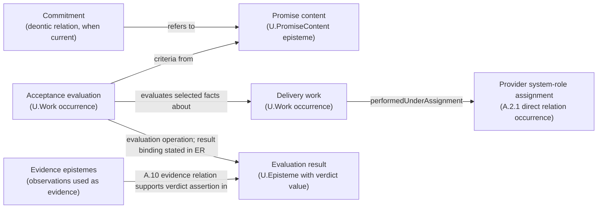

## A.2.3 - `U.PromiseContent` (Promise Content)
> **Type:** Definitional promise-content episteme pattern
> **Status:** Stable

### A.2.3:0.1 - Kind Settlement

`U.PromiseContent` is a dependent durable promised-outcome episteme under the episteme settlement.

### A.2.3:0 - Use This When

Use this pattern when a project needs to state what is promised to a consumer before asking who is obligated, what work occurred, which system exposes access, or which evaluation method and A.10 evidence relations support a fulfilment assertion.

Typical moments:

- an SLA publication, service catalog, product offer, public API promise, utility offer, or government-service description contains a statement about what a consumer may rely on;
- a team says "the service" but might mean promise content, provider organization, API, access point, delivery system, method, ticket, or performed work;
- a fulfilment claim needs evaluation work that applies declared acceptance criteria to exact delivery-work facts, affected entities and post-work states, and any exact delivery or acceptance relation current for the use; the actual evaluation-operation result binding, optional verdict episteme, and A.10 evidence relations remain separate;

**Primary EntityOfConcern.** The EntityOfConcern of this pattern is `U.PromiseContent`: a consumer-facing promise-content episteme. For each PromiseContent episteme, the exact C.2.1 EntityOfConcern is the A.2.3:4.1.1 `OutcomeSpec` episteme designated by `promisedOutcomeSpecRef`. Its claim graph states the promised outcome, any eligibility predicate, and acceptance claims; `accessSpec` separately describes the access method when that description is current.

**First useful move.** Write the promise content as a clause: what outcome is promised, under which exact effective `U.ReferenceScheme` and `U.ClaimScope`, which exact local consumer system-role kind or other eligibility predicate applies, how access is described when relevant, and which acceptance criteria selected work facts and post-work states must satisfy. Name the evaluation method, evidence epistemes, and A.10 evidence relations separately so a fulfilment assertion can be checked. Use `U.Commitment` only for an actual duty bearer after the applicable constitutive rule and its required instituting basis obtain.

**What goes wrong if missed.** The word "service" starts naming provider, API, method, ticket, work, department, and promise at once. Teams then judge work against an implicit promise, treat access systems as obligations, or count performed work without knowing which promised outcome it was meant to satisfy.

**What this buys.** One consumer-facing promise-content episteme with explicit outcome and acceptance claims. Each neighboring claim keeps its named `EntityOfConcern` and direct relation, defined or tested by its own pattern.

**Not this pattern when.** If the current `EntityOfConcern` is an individual deontic relation, use `A.2.8`; if it is performed delivery Work, use `A.15.1`; if service or access wording hides its concrete subject or direct relation, start with A.6.P:4.11a. An exact bearer or access-providing arrangement is only one possible recovered reading; code or another episteme, Method, Work occurrence, participation, promise, permission, status, and direct relations keep their own readings. Use A.1 or A.1.SCR only when a separate repaired claim depends on that exact entity being a system. If source agreement or SLA wording combines several objects, use `A.6.C` to unpack them.

### A.2.3:1 - Problem frame

Across domains the word **service** is used for many different things: a server or **provider**, an **API**, a **procedure**, a **run**, a **department**, even a **product bundle**. Such polysemy is productive in everyday speech. In a normative model, the current claim must identify which referent is meant.

FPF therefore reserves **`U.PromiseContent`** for one kernel meaning: a consumer-facing **promise content** clause. When *service* denotes something else, use **A.6.P:4.11a** to recover whether it denotes code or another episteme, a Method, a Work occurrence or ordinary run, provider participation, an exact bearer or access-providing arrangement, permission, status, or a direct relation. A product label chooses none of these readings, and bare *service* has no default system reading. After recovery, name the referent or relation. Apply A.1 or A.1.SCR only when the recovered referent is an entity and the claim depends on its being a system.

This keeps the kernel minimal while keeping the prose readable to non‑mathematicians: the canonical symbol is `U.PromiseContent`, and the head kind in normative text is always *promise content*.


**Plain reading.** A promise content says what a consumer may rely on. A provider System can be classified under a local provider system-role kind. When a claim needs exact delivery Work, use A.13 to identify the System that actually did it. A.15.1 then admits the dated occurrence as Work from its Method, history, extent, and containing System, without relying on F.6. If the current use also needs to say exactly under which assignment that Work was performed, F.6 checks the separate relation against the same assignment used by A.13. A `U.MethodDescription` describes the Method.

`PromiseContentUse` obtains between the delivery-work occurrence and the selected promise-content edition during the named interval. Work-participation, affected-referent, change, delivery, and acceptance relations state what happened.

A separately performed evaluation applies the declared operation or method; its result binding states the evaluation value. If another use needs a verdict episteme, use C.2.1 to identify it and A.15.PROD to state any applicable entity-identity-inception claim. Evidence relations support the relied-on assertions.

**Lexical note (L-SERV and A.6.P:4.11a).** Bare *service* does not determine one FPF referent. When that word carries a relied-on claim, use A.6.P:4.11a to recover the concrete referent or relation: for example, a promise-content episteme and an access-point system have different kinds and participate in different relations. E.10 `L-SERV` triggers that recovery. After recovery, name the referent or relation and use the pattern that defines or constrains the current claim. Resolve the defining or constraining `ClaimGraph` only when this claim or a named later use depends on a particular rule edition; the pattern id then serves as its locator.

### A.2.3:2 - Problem

Without a first-class `U.PromiseContent`, a project description tends to make five recurring category errors:

1. **Provider = Service.** Calling the provider **system** or team “the service” collapses that provider referent with the promise-content episteme.
2. **API = Service.** Treating an **interface or endpoint** as the service hides the promised consumer-side outcome and its acceptance criteria.
3. **Method or plan = promise content.** Treating a semantic method, a method-description episteme, or a work plan as the promise content hides the consumer-facing outcome and acceptance claims.
4. **Run = Service.** Logging **Work** as "a service" erases the promise-content episteme and acceptance specification needed for SLA reasoning.
5. **Business ontology lock-in.** Large domain schemes are imported wholesale, losing FPF universality and comparability across projects and domains.

### A.2.3:3 - Forces

| Force                                       | Tension                                                                                                       |
| ------------------------------------------- | ------------------------------------------------------------------------------------------------------------- |
| **Consumer promise vs provider ability** | Promise content states the consumer-side outcome; capability states what the provider System can do under declared conditions. |
| **Specification vs execution** | Promise content remains an episteme; exact delivery-work facts, affected entities, post-work states, and separately governed delivery or acceptance relations are evaluated against the promised predicates. The evaluation operation's result binding and any verdict episteme remain distinct from those subject facts. |
| **Universality vs domain richness**         | One kernel meaning must cover IT, utilities, healthcare, public services—without absorbing domain taxonomies. |
| **Reviewable acceptance vs method autonomy** | Consumers need named outcome predicates, characteristics, scales, target values, and acceptance criteria. Systems classified under provider system-role kinds and holding exact assignments retain freedom to select delivery methods through method-selection work; an individual deontic duty enters only through an independently obtaining `U.Commitment`. |
| **Stability vs evolution** | A changed promise creates a new promise-content episteme edition, while earlier work occurrences and evidence relations retain their own identities. |

### A.2.3:4 - Solution - Define `U.PromiseContent` as the promise-content episteme

**Definition (normative).**
A **`U.PromiseContent`** is an externally oriented promise-content episteme. Its claim content states a promised consumer-side outcome, any eligibility predicate, and acceptance criteria by which fulfilment is evaluated. Its optional `accessSpec` describes the access method. Interpretation is fixed by its effective `U.ReferenceScheme`; `U.ClaimScope` states where the claims hold.

`U.PromiseContent` is not a deontic commitment relation. One or more explicit `U.Commitment` occurrences under A.2.8 may have the promise content in their referents position; the promise-content episteme does not obligate an actor by itself.

In normative prose, the head phrase is **promise content**. **Service offering clause** and **service promise clause** are admissible Plain twins for that promise-content use; bare *service* does not identify a promise-content episteme.

Species-level identity follows C.2.1:

```text
PromiseContentIdentity = <
  content,
  promisedOutcomeSpecRef,
  effectiveReferenceScheme
>
```

`promisedOutcomeSpecRef` is a `U.EpistemeRef` field that designates the exact A.2.3:4.1.1 `OutcomeSpec` episteme about which the promise claims are made; that episteme is the exact EntityOfConcern of this PromiseContent episteme. The field is not `EntityOfConcernSlot`: that SlotKind names the participant meaning only inside the reusable C.2.1 constitution `RelationSignature`. `OutcomeSpec` is a specification-use episteme form, not a separately admitted U-kind. The exact `claimScope` qualifies where the promise-content claims hold and remains outside the identity tuple.

* **FPF kind:** `U.Episteme`.
* **Time stance:** the promise content can be authored before delivery; later exact delivery-work facts, affected entities, post-work states, and any current delivery or acceptance relations are tested against the declared outcome and acceptance predicates. Evaluation work and the actual operation-result binding remain separate; when a verdict episteme is constituted, C.2.1 and A.15.PROD govern its identity and inception, while A.10 evidence relations support the relied-on assertions.
* **Orientation:** consumer-facing promise claims, not provider capability claims.
* **Publication boundary:** The selected promise-content `U.Episteme` may participate in an exact `EpistemePublicationRelation` for a declared audience and bounded use. `PublicationFormExpressionRelation` relates that selected edition to its publication form, and `PublicationFormBearingRelation` relates a `U.PresentationCarrier` to the form it bears. Promise-content identity follows the C.2.1 episteme identity rule; no publication-relation occurrence, form, or carrier enters that rule.

#### A.2.3:4.1 - Promise-content schema

```text
U.PromiseContent : U.Episteme {
  content                  : U.ClaimGraph,
  promisedOutcomeSpecRef   : U.EpistemeRef, resolving to OutcomeSpec,
  effectiveReferenceScheme: U.ReferenceScheme,
  providerSystemRoleKindRef : U.KindRef,
  consumerSystemRoleKindRef?: U.KindRef,
  claimScope               : U.ClaimScope,
  accessSpec?              : U.MethodDescription,
  acceptanceSpec           : U.Episteme,
  unitOfDelivery?          : U.Episteme
}
```

* `content` carries the promised-outcome, eligibility, and acceptance claims together with the optional `accessSpec` value when an access-method description is current; it is not an untyped text slot.
* `providerSystemRoleKindRef` and `consumerSystemRoleKindRef` are promise-content fields typed by the existing `U.KindRef`; each resolves to one exact local system-role kind. `accessSpec`, `acceptanceSpec`, and `unitOfDelivery` are episteme values carried by value in the claim graph; a publication or other declared representation may express them through `U.EpistemeRef` values that resolve to those same epistemes without changing their kinds. Changing one of these content values or resolved kind references changes `content` and therefore the promise-content identity.
* `promisedOutcomeSpecRef` resolves to the A.2.3:4.1.1 `OutcomeSpec` episteme.
* `effectiveReferenceScheme` makes the claim graph and its references interpretable.
* `providerSystemRoleKindRef` and `consumerSystemRoleKindRef` identify local work-facing kinds; actual providers and consumers enter only through named occurrences of directly declared species under `U.SystemRoleAssignment`.
* `claimScope` is the exact `U.ClaimScope` over which the promise claims hold; it states the applicable operating conditions, populations, locales, and other admitted slices instead of leaving extent implicit.
* `accessSpec` describes the access method enacted when the admitted holder system of an eligible consumer system-role assignment requests access; an access-point system remains separate.
* `acceptanceSpec` states the acceptance criteria and selects the exact evaluation Method. It cites a MethodDescription edition only when the acceptance claim depends on that episteme's claims. Evidence-admissibility conditions may be stated there; actual evidence-use relations remain separate.
* `unitOfDelivery` states how accepted delivery work is counted when counting is current.
* There is no generic `modelUseStructureRef` field. When an independently selected `BoundedModelUseStructure` changes one actually model-local receiving interpretation, the receiving assertion or use designates that structure separately; the structure neither identifies the promise content nor becomes an optional participant of `PromiseContentUse`. A genuinely structure-dependent relation species would require its own direct pattern, mandatory structure participant, stronger predicate, and occurrence-identity rule.
* An internal delivery method remains `U.Method`. An already identified episteme is a `U.MethodDescription` only when its exact `EntityOfConcern` resolves to that Method and at least one claim says how that Method is done. A promise-content or acceptance claim may cite that episteme for one named use; Method-selection work, performed work, and `PromiseContentUse` remain separately governed.

#### A.2.3:4.1.1 - OutcomeSpec - promised Work, post-work result, or both

This section is the authoritative FPF locus for the promise-facing `OutcomeSpec` shape. A.7 supplies the strict distinction among the specification episteme, Work occurrence, affected referent, post-work state, counting rule, and evidence; it does not define another schema.

`promisedOutcomeSpecRef` resolves to an independently identified specification-use episteme that says **what is promised**. `OutcomeSpec` is a specification-use episteme form, not a separately admitted U-kind.

```text
OutcomeSpec : U.Episteme ::= {
  mode: WorkOnly | ResultOnly | Composite,

  workSpec?: {
    methodConstraintRef?: U.MethodRef,            // resolves directly to an admitted U.Method
    methodDescriptionRef?: U.EpistemeRef,         // only when exact claims in one A.3.2-admitted edition are used
    workPredicateRef: U.EpistemeRef                // predicate on selected facts about delivery Work
  },

  resultSpec?: {
    entityOfConcernRef?: U.EntityRef,              // promised affected referent or its declared kind
    statePlaneRef?: StatePlaneRef,                 // where the post-condition is interpreted, when current
    postConditionRef: U.EpistemeRef                // predicate on the required post-work state
  }
}
```

Mode completeness is exact:

* `WorkOnly` requires `workSpec` and omits `resultSpec`;
* `ResultOnly` requires `resultSpec` and omits `workSpec`; and
* `Composite` requires both.

`workSpec` constrains selected facts about delivery Work. A Method constraint resolves directly to the Method; a separate MethodDescription reference is optional and edition-specific. `resultSpec` constrains the exact affected referent selected for the delivery and its required post-work state. At fulfilment time, state any actual-change, production, delivery, acceptance, or receiving-use relation under its own predicate. An optional mathematical Delta expression remains a separate lens only when a named comparison uses it; no `U.Work.Delta` field or universal change record is required.

In ordinary agreement wording, *outcome* may mean Work, achieved state, or both. Recover the intended mode instead of inventing one `OutcomeInstance` kind. A downstream bundling, invoicing, or dispute claim separately references the actual Work occurrences, affected entities, post-work states, direct relations, evidence epistemes, and evidence-use relations it needs.

**Examples.** `Work for at least five minutes` is WorkOnly. `A hole at least one metre deep exists at the stated site` is ResultOnly. `Cut and style the client's hair within twenty minutes, with the resulting hairstyle satisfying the evening-style condition` is Composite.

The head noun *outcome* is intentionally broad. When the passage means Work, affected entity, or required post-work state, name that object directly. Counting is not part of OutcomeSpec; A.2.3:4.1.2 governs `unitOfDelivery`.

#### A.2.3:4.1.2 - Unit-of-delivery counting

Use `unitOfDelivery` only when a receiving use counts accepted delivery. It is a specification-use episteme carried in the promise content.

An ordinary rule may say: `Count one accepted delivery per appointment; rework under the same appointment does not add another unit.` When replay or measurement needs a structured representation, use only the fields that rule requires:

```text
UnitOfDeliverySpec : U.Episteme ::= {
  unitDesignator: U.NameToken,
  countingRule: {
    selectorRef: U.EpistemeRef,                   // selects only delivery Work for which fulfilment obtains
    quantityRuleRef: U.EpistemeRef,               // maps selected facts to the count or measured quantity
    aggregationRef?: U.EpistemeRef,
    dedupeKeyRef?: U.EpistemeRef,
    countingPolicyRef?: U.EpistemeRef,
    measurementMethodRef?: U.MethodRef,
    measurementMethodDescriptionRef?: U.EpistemeRef,
    evidenceAdmissibilityRef?: U.EpistemeRef
  }
}
```

The selector admits only Work occurrences for which the promise's delivery and acceptance predicates are satisfied. For a cross-promise aggregate using one Work occurrence, or when rework must not add another delivery unit, `dedupeKeyRef` or the cited counting policy states the intended boundary. Separate per-promise counts may use the default below. A measurement Method, its description, evidence-admissibility rule, evidence epistemes, and evidence-use relations appear only when the count depends on a measurement reading or relied-on evidence. Pure counting needs none of that apparatus.

If `unitOfDelivery` is absent, the local default is one unit per obtaining `PromiseContentFulfilmentRelation` occurrence. A separately governed charging relation may consume the resulting quantity but does not define this counting rule.

#### A.2.3:4.1.3 - Recommended `acceptanceSpec` mini-schema *(informative, non-kernel)*

Projects may express `acceptanceSpec` with the following small schema when downstream evaluation work requires replayable criteria and verdict semantics. Here `SC` denotes the promise-content episteme containing that acceptance specification:

```
AcceptanceSpec (recommended) ::= {
  targetOutcomeSpecRef?: U.EpistemeRef,          // resolves to OutcomeSpec; default is SC.promisedOutcomeSpecRef
  criterionRefs: [U.EpistemeRef],                // each resolves to one evaluation-criterion episteme
  evaluationMethodRef: U.MethodRef,               // resolves directly to the evaluation Method
  evaluationMethodDescriptionRef?: U.EpistemeRef, // only when exact claims in one A.3.2-admitted edition are used
  verdictScaleDescriptionRef: U.EpistemeRef,     // resolves to one declared scale description
  GammaTimePolicyRef?: U.EpistemeRef             // resolves to the policy selecting the evaluation window
}
```

* **`targetOutcomeSpecRef`** makes explicit *which* promised outcome is being judged; if omitted, it is the containing promise content’s `promisedOutcomeSpecRef`.
* **`criterionRefs`** resolve to evaluation-criterion epistemes. Their predicates are evaluated over the same selected work facts and post-work state references used for the targeted `OutcomeSpec`; direct evidence relations separately support assertions about those facts and states.
* **`evaluationMethodRef`** resolves directly to the evaluation Method. **`evaluationMethodDescriptionRef`**, when present, cites one A.3.2-admitted episteme edition whose claims constrain or explain that Method; the description is neither the Method nor the evaluation Work.
* **`verdictScaleDescriptionRef`** resolves to one scale-description episteme governed by the characteristic and scale patterns. That description states the admitted verdict values and how non-delivery is represented. Informative examples include Boolean `pass/fail`, trichotomy `pass/partial/fail`, or named graded values, with non-delivery represented as `fail`, `N/A`, or `Inconclusive`; these values are examples, not defaults.
* **`GammaTimePolicyRef`** keeps temporal selection explicit and non-retroactive (F.10 and F.12): it resolves to the policy stating whether judgement is per work occurrence, reporting window, or another named temporal selection. Population and locale remain in `U.ClaimScope`; they are not temporal-policy values.

This mini-schema is a recommendation only: it does not admit another U-kind. An acceptance-specification episteme may contain these declared schema fields by value or refer to their values through the declared RefKinds.

#### A.2.3:4.2 - What `U.PromiseContent` is **not**

* **Not a provider:** use an assignment occurrence and its declared species under `U.SystemRoleAssignment`. The occurrence identifies the provider System and assigned local kind; the species defines those participant meanings and the assigned-kind domain.
* **Not an individual deontic commitment:** that is one obtaining `U.Commitment` under A.2.8 whose actual duty bearer, exact referents, constitutive rule, instituting basis, scope, and validity are established independently.
* **Not an access point or bearer:** addressable *service*, server, desk, endpoint, process, component, application, host, or cluster wording first goes to A.6.P:4.11a. Recover whether it denotes code or another episteme, a Method, a Work occurrence or ordinary run, an exact bearer or access-providing arrangement, or another directly governed object; apply A.1 or A.1.SCR only when a separate repaired claim depends on an exact recovered entity being a system.
* **Not a method or method description:** the semantic way of doing is `U.Method`; a recipe or other episteme describing that way is `U.MethodDescription`.
* **Not delivery work or its description:** performed delivery is `U.Work`; a ticket, case description, or incident description is a separately governed episteme about planned or performed work.
* **Not a work schedule:** use `U.WorkPlan` under A.15.2 when the content coordinates intended Work.
* **Not a capability:** capability is the provider system's admitted ability to perform a declared work family or produce a declared result class within its `U.WorkScope`, measure set, qualification window, and currentness condition. Delivery under a promise may depend on one or more capability instances.
* **Not its scope or use interval:** `U.ClaimScope` states where the promise claims hold, `U.WorkScope` states where a provider capability can deliver work, and `PromiseUseIntervalSlot` states when one `PromiseContentUse` occurrence obtains. These are three different values.

#### A.2.3:4.3 - Promise content, delivery work, and evaluation work

* **Before delivery work:**
  The promise-content episteme declares its effective `U.ReferenceScheme`, named `U.ClaimScope`, promised outcome specification, access specification when current, and acceptance specification. The provider system's ability remains a holder-dependent `U.Capability` instance under A.2.2. A capability-fit predicate tests that instance against the thresholds selected for the planned delivery work, including any threshold stated by the chosen method description. Method-selection work may yield a C.11 `ChoiceResult`; `enactsMethod` obtains between the later delivery-work occurrence and the selected `U.Method`. A relied-on episteme is a `U.MethodDescription` only when it meets A.3.2 membership, and the promise-content or acceptance claim may cite it for the named use.

* **Run‑time:**
  For request or visit Work, use A.13 to identify the actual consumer System `S`, then let A.15.1 admit `requestWork` independently. If the current use must also state under which assignment the request was performed, F.6 checks `performedUnderAssignment(requestWork, consumerRA)` against the same assignment used by A.13 and compares `S` with `consumerRA.HolderSystemSlot`.
  For delivery Work, use A.13 to identify the actual provider System `S`, then let A.15.1 admit `deliveryWork` independently. If the current use must also state under which assignment the delivery was performed, F.6 checks `performedUnderAssignment(deliveryWork, providerRA)` against the same assignment used by A.13 and compares `S` with `providerRA.HolderSystemSlot`.
  For evaluation Work, use A.13 to identify the actual evaluator and let A.15.1 admit the dated occurrence before saying that it enacts the Method selected by `acceptanceSpec`. Add F.6 only if the current use must also state under which assignment the evaluation was performed. Cite the optional MethodDescription only when the evaluation claim depends on that edition. The actual evaluation-operation application carries its argument bindings and result value. When another use needs a durable verdict episteme, C.2.1 governs that episteme and A.15.PROD governs any current identity-inception claim. The counting rule in `unitOfDelivery` maps admitted fulfilment occurrences to unit counts.
  The verdict episteme may assert whether a named service-level objective or another acceptance criterion was satisfied during the declared window. When a separately obtaining `U.Commitment` has the same `U.PromiseContent` in its referents position, the supported assertion concerns fulfilment of content that is also a referent of the obligation. Neither the operation-result binding, verdict episteme, nor commitment is a property of the promise-content episteme.

  When a separate F.6 `performedUnderAssignment(W, RA)` claim is made, `W` is already admitted and `RA` is the same assignment used by A.13. F.6 compares that assignment's holder with the actual performer already identified through A.13 and used by A.15.1. A missing or failed F.6 check leaves the Work intact.

> **Memory hook:** *Promise content states what is promised. A method constrains possible work. A system performs work. Evaluation binds a result value. A verdict episteme states the judgment. Evidence supports that assertion.*

#### A.2.3:4.4 - Didactic card: Relations around one service-delivery evaluation

> **Didactic (non-normative).** This representation keeps each promise-content episteme, access-description episteme, work occurrence, and direct relation in one delivery evaluation visible without prescribing an order of work. Promise content and an access description remain epistemes; an individual commitment and a system-role assignment remain relations; delivery and evaluation remain work occurrences; evidence remains in its A.10 relations. When order matters, describe semantic method order in `U.MethodDescription`, intended dated order in `U.WorkPlan`, and transformation dependencies in the relevant `TransformationFlowStructure`.
>
> `U.PromiseContent` states the promise. An A.2.8 `U.Commitment` relation may refer to that content; its duty-bearer position is filled by one System or separately identified party. The provider-assignment species defines holder and assigned-kind meanings. Delivery and evaluation follow the §4.3 route: A.13 identifies who actually performed the Work, and A.15.1 admits the dated occurrence independently. The diagram shows an F.6 edge only when this case also needs the exact assignment under which that Work was performed. Evidence relations support selected delivery-work facts and post-work states. The evaluation operation carries its result binding, while C.2.1 identifies any verdict episteme and A.15.PROD states any identity-inception claim.
>
> This informative diagram is a publication-side representation, not new ontology. It prevents two category errors: treating `U.PromiseContent` as the addressable access system, and treating a publication-side list or diagram of service senses as a relation occurrence that replaces the direct relations shown here.

**Reading guide (one breath).**
* The **promise content** is the consumer-facing outcome and acceptance statement.
* In the A.2.8 **commitment relation**, the actual duty-bearer position is filled directly and the referents position contains the promise-content clause. The exact constitutive rule and its required instituting basis must obtain before that individual relation is asserted.
* The **provider system-role assignment** is an occurrence of a declared assignment species. The species defines the holder, assigned-kind, and any other identity-bearing participant meanings; the occurrence identifies the provider System, its assigned local kind, and any other participant values. The assertion has exact claim content, EntityOfConcern, and effective ReferenceScheme; its ClaimScope, selected slice, normative-frame edition, qualification window, or operating condition is stated separately when it changes interpretation or validity. None is a world-side assignment participant.
* A.6.P:4.11a recovers the concrete referent or relation denoted by *service* wording. It adds no service-situation participant: provider assignment, access description, access-point system, delivery system, delivery method, promise content, and work occurrence remain distinct and keep their own kinds. Use A.10 for the evidence relations.
* **Delivery Work** is what happened. Follow the §4.3 performer-and-Work route, and add the separate F.6 assignment check only if this use must also say exactly under which assignment the Work was performed. Exact affected referents, pre-work and post-work states, and any actual-change, production, delivery, or acceptance relations remain separately identified. Evidence-use relations support assertions about those facts. Evaluation Work follows the same route before its selected evaluation Method, application result, and any verdict episteme are stated separately.

**Litmus rule (addressability).**
If the current claim is about invocation, connection, visitation, restart, or scaling, first use A.6.P:4.11a to recover the exact process, deployed component, endpoint, application, host, cluster, desk, or other bearer. That cue establishes neither `U.System` nor a whole delivery-system boundary. Apply A.1 or A.1.SCR only when the repaired claim depends on systemhood; after recognition, call the entity a **service access point** or **service delivery system** only when that exact boundary claim is current. Otherwise keep the exact bearer and keep promise content separate.

### A.2.3:5 - Archetypal grounding (engineer‑manager friendly)

**Worked-case premise.** `E.24.UK` has already admitted the public `U.System` kind. Every exact entity named as a system in the rows below independently satisfies the complete A.1 criterion, including acting eligibility. If that premise cannot be established, keep the exact entity without system membership and stop only the provider-assignment, access-point, delivery-system, or Work-attribution claim that depends on it; other direct claims may continue under their subject patterns.

| Domain | Promise-content episteme | Provider and consumer assignments | Access specification | Delivery work | Evidence and evaluation |
| --- | --- | --- | --- | --- | --- |
| Cloud storage | Store and retrieve blobs up to 5 TB under declared criteria—for example, 99.9% availability and 99.999999999% durability (eleven nines); these values illustrate targets and are not defaults. | `CloudStoragePlatformSystem` holds `StorageProviderSystemRole`; `BackupControllerSystem` holds `StorageConsumerSystemRole`, each through an A.2.1 assignment occurrence and its declared species. | `S3ApiDescription-vX`, a `U.MethodDescription`; the endpoint is a separate bearer, treated as a `U.System` under the worked-case premise. | Dated PUT, GET, replication, and integrity-check Work occurrences participating in `PromiseContentUse`. | Request and integrity observations enter direct evidence relations; evaluation applications bind availability or durability results, and separately constituted verdict epistemes state the judgments. |
| Manufacturing utility | Deliver compressed air at 8 bar in Zone B under stated pressure, flow, and purity criteria. | `CompressedAirPlantSystem` holds `UtilityProviderSystemRole`; `LineBSystem` holds `UtilityConsumerSystemRole`, each through an A.2.1 assignment occurrence and its declared species. | `ZoneBManifoldAccessDescription`, a `U.MethodDescription`; the manifold is a separate bearer, treated as a `U.System` under the worked-case premise. | Dated compression and delivery Work occurrences. | Pressure, flow, and purity observations support delivery claims; an evaluation application binds the comparison result under the declared scale and window, and a verdict episteme states the judgment. |
| Public passport service | Issue an admissible passport within 20 days under declared defect and eligibility criteria—for example, a ≤ 1% defect target; this value is illustrative, not a default. | `IssuingAgencySystem` holds `PassportIssuerSystemRole`; `ApplicantPersonSystem` holds `PassportApplicantSystemRole`, each through an A.2.1 assignment occurrence and its declared species. | `PassportApplicationAccessDescription`, a `U.MethodDescription`; portal and service-desk bearers are access-point `U.System` values under the worked-case premise when that boundary claim obtains. | Dated application-handling and passport-issuance Work occurrences. | Submission, issuance, elapsed-time, and defect observations support claims; evaluation applications bind lead-time or defect results, and separately constituted verdict epistemes state the judgments. |

**Key takeaway.** The same pattern yields one promise-content episteme in each domain. Direct system-role assignment, `PromiseContentUse`, evaluation-operation, evidence, acceptance, and publication relations retain their own participants and governors; evaluation remains separately performed `U.Work`.

**Locality replay.** In the cloud-storage row, identify `CloudStoragePromiseContent-v3`, `CloudStorageOfferScheme-2026`, and `EligibleStorageAccounts-EU-2026Q3` as the exact promise-content edition, its effective scheme, and its `U.ClaimScope`. Then `PromiseContentUse(PUT-2026-07-14-1042, CloudStoragePromiseContent-v3, Interval-PUT-1042)` ties one dated delivery-work occurrence to that edition. Name a selected model-use structure only in a receiving assertion or use that is actually model-local. If another catalog scheme is consumed, add the exact obtaining F.9 Bridge, the separate claim that it suits this bounded use, and the A.10 evidence-provenance relation with `RelianceDisposition=pass`. Use B.3 only if an actual named assurance claim about this use is current.

### A.2.3:5.1 - Bias-Annotation

A.2.3 repairs the collapse of several service-related referents into one service label. A visible service name often denotes provider, access point, method, work, commitment, ticket, evidence, and promised outcome without saying which claim is current. The pattern recovers the promise-content episteme first; A.2.8 then governs commitment, A.2.1 provider participation, A.3.2 access description, A.15.1 delivery work, A.10 evidence claims, and the direct outcome and acceptance patterns their respective relations.

In an agreement or SLA, an A.2.8 `U.Commitment` may have promise content in its referents position. An agreement publication, service catalog, API page, or offer publication may be a `U.PresentationCarrier` bearing a form that expresses selected `U.Episteme` values about the agreement, promise content, commitment, or fulfilment work. An exact `EpistemePublicationRelation` may make each selected episteme available to its declared audience for its bounded use. These commitments, epistemes, forms, publication occurrences, and carriers retain separate identities.

### A.2.3:6 - Mapping the common “service” picture to FPF (didactic bridge)

A common service diagram is a representation. Recover the represented systems, epistemes, work occurrences, and relation occurrences as follows:

* **Provider participation** -> when this mapping needs the provider's assignment, name its occurrence and declared species under `U.SystemRoleAssignment`. The occurrence supplies its holder System, assigned local kind, and any other participants; the species defines their meanings. For each selected delivery-work occurrence, follow the §4.3 route to identify the actual performer and admit the Work independently. Add F.6 only if the mapping must also say exactly under which assignment that delivery was performed; a missing or failed check leaves the delivery Work intact.
* **Acceptance criterion** -> an evaluation-criterion episteme in `U.PromiseContent.acceptanceSpec`; its target values, verdict scale, and `GammaTimePolicyRef` remain explicit. A `U.WorkPlan` is added only when planned delivery or evaluation work is current.
* **SLA obligation** -> one A.2.8 `U.Commitment` occurrence whose actual duty bearer is explicit and whose referents include the relevant `U.PromiseContent`; assert it only after the applicable constitutive rule and required instituting basis obtain. Use A.6.C when one SLA publication combines wording about commitment, promise content, evidence specification, and publication relations.
* **Published SLA terms** -> the selected `U.PromiseContent` / `U.Episteme`, the exact publication form that expresses it for the bounded use, the `U.PresentationCarrier` bearing that form, and the obtaining `EpistemePublicationRelation` occurrence that makes the selected edition available to the declared audience. When publication work also communicates or institutes a commitment, add the named A.2.9 speech-act and A.2.8 commitment relation occurrences; publication alone neither creates the commitment nor establishes fulfilment.
* **Operating conditions** -> the named `U.ClaimScope` under A.2.6. The acceptance specification may cite that scope; it does not replace it.
* **Promised subject** -> resolve `promisedOutcomeSpecRef` and follow the declared mode. Use `workSpec` for promised Work conditions and, when `resultSpec` is present, use its postcondition and any `entityOfConcernRef` to identify the required affected referent and post-work state. State only the direct delivery or acceptance relations required by the current claim.
* **Customer material—“ours versus theirs.”** -> If the current claim depends on who owns or has custody of data, an asset, or a case, name the exact obtaining system-role assignment when work-facing assignment matters, and name the ownership or custody relation with its actual participants when that is the claim. Neither relation substitutes for the other, and neither becomes a kernel-global property of `U.PromiseContent`.
* **Access** -> `accessSpec : U.MethodDescription` describes the Method enacted when an eligible consumer holder requests access. Recover the endpoint, desk, manifold, or other exact bearer through A.6.P:4.11a. Its label and addressability establish no `U.System` membership. Apply A.1 or A.1.SCR only when a current access-point, delivery-system, performer, or assignment claim depends on systemhood; otherwise keep the bearer claim separate.
* **One `PromiseContentUse` occurrence** -> consumer request Work and provider delivery Work remain separate occurrences. Follow the §4.3 performer-and-Work route for each. If this mapping must also state the assignment under which either occurrence was performed, add its separate F.6 relation against the same assignment used by A.13; a missing or failed check leaves the Work intact. When request Work follows `accessSpec`, its A.15.1 `methodDescriptionRef` resolves to that same `U.MethodDescription`; following the description does not by itself introduce a second relation occurrence. `PromiseContentUse` obtains between selected delivery Work and the selected promise-content edition during `PromiseUseIntervalSlot`.
* **Consumer-side changed entity or relation** -> recover the exact affected-referent and actual-transformation facts, plus any local entity-identity-inception, delivery, acceptance, or receiving-use claim that the current promise evaluation needs. If the changed entity is a holder system and its post-work state calls for a new or revised `U.Capability` instance, use A.2.2 for that capability instance and its currentness relations.
* **Service-enabled consumer-side capability or activity** -> If the question is about ability, identify the consumer holder's `U.Capability` instance and state its A.2.2 qualification and currentness claim. If the question is about activity, identify the consumer-side dated `U.Work` under A.15.1. If the claim also says that delivery changed the consumer or was used by that Work, state only the exact actual-change or receiving-use relation that currently obtains; otherwise keep the objects separate. Do not create another U-kind or a generic capability-use relation.
When a domain claim concerns catalog entries, exposure relations, charging relations, or entitlement relations, govern those entries, participants, and relations directly. Relate them to `U.PromiseContent` only through named relations; do not treat them as components of `U.PromiseContent` or replace their direct relations with a locally minted context relation.

### A.2.3:7 - Conformance Checklist (normative)

**CC‑A2.3‑0 (Prose head phrase).**
In normative prose, an instance of `U.PromiseContent` SHALL be referred to as a **promise content** (or **service offering clause** or **service promise clause**) and SHALL NOT be referenced by the bare head noun *service*. For the conditional L-SERV recovery rule, see CC-A2.3-10.

**CC‑A2.3‑1 (Type).**
`U.PromiseContent` **IS** a consumer-facing promise-content `U.Episteme`. One or more exact `EpistemePublicationRelation` occurrences may make the same selected promise-content edition available through separately identified publication forms and `U.PresentationCarrier` values without changing its episteme identity; no publication form or presentation carrier is the promise content. `U.PromiseContent` is not a `U.System`, `U.Method`, `U.MethodDescription`, `U.Work`, or `U.WorkPlan`.

**CC-A2.3-2 (Semantic locality).**
Every promise content names its effective `U.ReferenceScheme`, `promisedOutcomeSpecRef`, and exact `U.ClaimScope`. A selected `BoundedModelUseStructure` may be designated only by the receiving assertion or use when it changes one actually model-local interpretation; it is neither a promise-content field nor an optional participant or identity discriminator of `PromiseContentUse`.
**CC-A2.3-3 (System-role kinds stay distinct from holders and assignments).**
`providerSystemRoleKindRef` and, when present, `consumerSystemRoleKindRef` are promise-content fields typed by `U.KindRef` and resolve to local system-role kinds. Provider and consumer Systems enter through assignment occurrences whose species are declared under `U.SystemRoleAssignment`; a kind label or reference alone identifies neither a holder nor a performer.

**CC-A2.3-4 (Acceptance).**
`acceptanceSpec` **MUST** be present and **MUST** define how delivered `U.Work` is judged as pass, fail, or a declared grade against named evaluation criteria and target values. Any SLA deontics are represented through `U.Commitment`. The promise content **MUST** declare **Claim scope (G)** where operating conditions, populations, locales, or another claim extent matter. Every verdict cites an explicit **Gamma_time** window.
If the acceptance criteria mention measurable characteristics such as availability, latency, accuracy, cost, or safety, each characteristic MUST be introduced through C.16 and C.25 with its scale, unit when applicable, `U.DHCMethod` measurement template, and direct evidence relation. If the reading depends on a particular way of measuring, cite the `U.MethodDescription` that describes that measurement method. The characteristic is referenced by its exact identifier rather than by an unqualified KPI label.

**CC‑A2.3‑5 (Access).**
When the promised use relies on a request-facing access Method, `accessSpec` **MUST** identify the A.3.2-admitted `U.MethodDescription` that describes it. Separately recover the endpoint, desk, manifold, or other exact bearer through A.6.P:4.11a. Apply A.1 or A.1.SCR only when a current claim depends on that bearer being an access-point `U.System`; otherwise keep the bearer without the stronger claim. If no access-method description is current because access is ambient, `accessSpec` may be omitted. In either branch, keep an eligibility predicate in the promise content when eligibility is promised; when eligibility depends on a separately obtaining admission relation, identify that relation and use the pattern that defines or tests it.

**CC‑A2.3‑6 (Unit of delivery + counting rule).**
For a receiving use that counts accepted delivery, use the default one-unit-per-fulfilment rule or declare `unitOfDelivery` with the intended unit (for example, one request, kWh, or case) and counting rule. Declare `unitOfDelivery` when the default does not define the intended counting boundary, including rework or a cross-promise aggregate. The resulting count may fill a declared quantity position in a separately governed charging relation; that charging relation does not determine the unit-of-delivery specification.
When declared, `unitOfDelivery` includes the A.2.3:4.1.2 counting rule that maps fulfilment Work to unit counts without silent double counting. If omitted, the default is one unit per obtaining `PromiseContentFulfilmentRelation` occurrence.

**CC‑A2.3‑7 (No actuals on Promise Content).**
Resource and time actuals belong to the performed `U.Work` occurrence under A.15.1. An incident-log episteme may describe that occurrence and may separately participate in an evidence relation for a stated claim; neither the log nor its participation in that evidence relation fills a `U.PromiseContent` slot.

**CC-A2.3-8 (Provider capability stays separate).**
When delivery depends on provider ability, use the A.2.2 `U.Capability` instance for the provider holder system and the separate capability-fit predicate for the planned delivery work. Do not insert capability into promise-content identity or infer capability or fit from a system-role designation or assignment.
**CC-A2.3-9 (Edition and promise-use interval).**
A change to `content`, `promisedOutcomeSpecRef`, or `effectiveReferenceScheme` creates a new promise-content episteme edition under the C.2.1 identity rule. Each `PromiseContentUse` occurrence has one promise-content edition and one delivery-work occurrence as participants and `PromiseUseIntervalSlot` as its temporal qualifier; an untyped `version` or `timespan` entry fills none of those positions.

**CC‑A2.3‑10 (Lexical rule).**
Apply E.10 **L-SERV** and **A.6.P:4.11a** only when *service* or access-like wording occurs in a relied-on FPF claim, recommendation, decision, gate, assurance, publication, or reuse and hides the concrete subject, participant, predicate, kind, permission, Work occurrence, or next route. The author **MUST** name that hidden choice or stop the relied-on use; quoted, historical, illustrative, and harmless ordinary wording is outside this rule.

**CC‑A2.3‑11 (No mereology).**
Do **not** place a promise content clause in PBS or SBS, or treat it as a part or component. Structural assemblies live in PBS and SBS; the promise clause is an episteme (A.2.3). For hidden service referents, see CC-A2.3-10.

**CC-A2.3-12 (Plan, work, and evidence stay distinct).**
Planned-work windows and calendars are content of `U.WorkPlan` (A.15.2). Performed delivery belongs to `U.Work` (A.15.1). Exact affected referents, pre-work and post-work states, and direct actual-change, production, delivery, or acceptance relations remain separate. Evidence epistemes and evidence-use relations support assertions about those facts; they are not slots or parts of the Work occurrence.

**CC-A2.3-13 (Claim scope, work scope, and promise-use interval).**
The promise-content episteme names one exact `U.ClaimScope`; an intended maximal extent is stated as that scope rather than represented by omission. A provider capability instance separately names `U.WorkScope`. `PromiseUseIntervalSlot` is the temporal qualifier of each `PromiseContentUse` occurrence. The `ScopeCoverage` predicate is satisfied only when the selected context slice belongs to the claim scope. When membership depends on time, name an explicit `Gamma_time` selector and its membership boundary; retain every selector already declared in the slice even when this predicate does not inspect it. Neither temporal extent nor capability scope replaces claim scope.

**CC-A2.3-14 (Scheme and scope bridges).**
Cross-scheme reuse first names the exact obtaining F.9 Bridge occurrence. A separate current C.2.1 claim with affirmative polarity must say that this Bridge suits the named bounded promise-content use, in the stated direction, under the use-specific correspondence rule, and within the permitted-loss tolerance. Ordinary reliance requires the exact A.10 evidence-provenance relation with `RelianceDisposition=pass` for that use. Use B.3 only when an actual named assurance claim is current; its result supports, narrows, or blocks only that bounded assurance use. Cross-scope reuse separately names the mapped `U.ClaimScope` and its A.2.6 relations.
**CC-A2.3-15 (OutcomeSpec typing).**
`promisedOutcomeSpecRef` MUST be a `U.EpistemeRef` resolving to an A.2.3:4.1.1 `OutcomeSpec` specification-use episteme. It MUST NOT point at a concrete `U.Work` occurrence, affected or delivered entity, actual operation-result binding, verdict episteme, or downstream effect, and `OutcomeSpec` MUST NOT be written as an independently admitted `U.OutcomeSpec`.

**CC-A2.3-16 (OutcomeSpec is explicit and mode‑complete).**
`promisedOutcomeSpecRef` MUST be present and MUST reference an `OutcomeSpec` that declares `mode in {WorkOnly, ResultOnly, Composite}` and satisfies A.2.3:4.1.1 mode completeness:
* `WorkOnly` → `workSpec` present, `resultSpec` absent
* `ResultOnly` → `resultSpec` present, `workSpec` absent
* `Composite` → both `workSpec` and `resultSpec` present

**CC-A2.3-17 (OutcomeSpec predicates and delivery-work relations).**
To determine whether a `U.Work` occurrence participating in `PromiseContentUse` delivers the promised outcome, resolve `OS` as the A.2.3:4.1.1 `OutcomeSpec` from `SC.promisedOutcomeSpecRef` and test the following applicable conditions.

* If `OS.workSpec` is present, the selected facts about the work occurrence satisfy `OS.workSpec.workPredicateRef`; when `methodConstraintRef` is present, the enacted method is compatible with that constraint.
* If `OS.resultSpec` is present, the exact affected referent and selected post-work state satisfy `OS.resultSpec.postConditionRef` on its declared state plane. Any actual-change, production, delivery, acceptance, receiving-use, or optional mathematical Delta-lens claim remains separately governed.
* A.10 evidence relations obtain between each relied-on satisfaction assertion and its supporting evidence epistemes.

Assert delivery only after these mode-specific conditions are established. Explicitly individuate `PromisedOutcomeDeliveryRelation` only when a downstream relation or claim must refer to its occurrence identity; otherwise retain the readable `deliversPromisedOutcome(W, OS)` assertion.
**CC-A2.3-18 (Acceptance evaluation supports rather than constitutes fulfilment).**
Follow the §4.3 route: use A.13 to identify the actual evaluator and let A.15.1 admit the evaluation Work independently before saying that it enacts the Method selected in `acceptanceSpec` over the same Work facts and post-work states used to test delivery. Add F.6 only if this evaluation account must also state under which assignment the Work was performed. Cite a MethodDescription only when the claim depends on that exact edition. The actual operation application carries its argument and result bindings. Any durable verdict episteme, identity-inception claim, and evidence-use relation remains separate and supports the fulfilment assertion without constituting the relation.

**CC-A2.3-19 (OutcomeSpec ↔ unitOfDelivery coherence).**
If `unitOfDelivery` is present, its counting rule states a `selectorRef` that selects only work occurrences eligible to satisfy `SC.promisedOutcomeSpecRef` in the declared mode. For a cross-promise aggregate using one occurrence, the rule states either `dedupeKeyRef` or cites the counting-policy episteme that defines the counting rule. A selector may denote work occurrences filling `FulfilmentWorkOccurrenceSlot` in obtaining `PromiseContentFulfilmentRelation` occurrences; it does not count work for which fulfilment has not been established.

**CC-A2.3-20 (Unit-of-delivery is computable from work facts).**
If `unitOfDelivery` is present, it follows A.2.3:4.1.2. A pure count needs only its selector, quantity rule, and any deduplication boundary. Add a measurement Method, MethodDescription, evidence-admissibility condition, evidence epistemes, and evidence-use relations only when the count actually depends on a measurement reading or relied-on evidence.

### A.2.3:8 - Promise-content use, delivery, evaluation, and evidence

Keep `PromiseContentUse`, `PromisedOutcomeDeliveryRelation`, evaluation `U.Work`, the actual evaluation-operation application and result binding, any verdict episteme, and A.10 evidence relations separate. A direct relation may obtain even when the current episteme about it is unresolved; evidence supports the claim and does not become the relation.

#### A.2.3:8.1 - Core relations

**`PromiseContentUse : U.Relation`.** This direct use relation obtains between one delivery-work occurrence and one promise-content edition during one named promise-use interval; it makes no fulfilment claim.

```text
PromiseContentUse : U.Relation
  DeliveryWorkOccurrenceSlot: U.Work, U.EntityRef
  PromiseContentSlot: U.PromiseContent, U.EpistemeRef
  PromiseUseIntervalSlot: temporal interval, byValue
```

Its occurrence key is `<DeliveryWorkOccurrenceSlot, PromiseContentSlot, PromiseUseIntervalSlot>`.

**`PromisedOutcomeDeliveryRelation : U.Relation`.** This derived relation obtains between one delivery-work occurrence and the A.2.3:4.1.1 `OutcomeSpec` resolved from the `PromiseContentUse` occurrence in which that work participates, when the conditions below hold.

```text
PromisedOutcomeDeliveryRelation : U.Relation
  DeliveryWorkOccurrenceSlot: U.Work, U.EntityRef
  PromisedOutcomeSpecificationSlot: U.Episteme, U.EpistemeRef constrained to A.2.3:4.1.1 OutcomeSpec
```

The relation obtains only when one `PromiseContentUse` occurrence has the delivery Work and promise-content edition as participants, that edition resolves the same `OutcomeSpec`, and the mode-specific conditions hold. `workSpec` tests selected Work facts. `resultSpec` tests the exact affected referent and selected post-work state; any actual-change, production, delivery, acceptance, receiving-use, or optional Delta-lens claim remains separately governed. Its occurrence key is `<DeliveryWorkOccurrenceSlot, PromisedOutcomeSpecificationSlot>`. The readable predicate is `deliversPromisedOutcome(W, OS)`. An episteme may assert that this relation obtains and evidence may support the assertion; neither makes the underlying facts satisfy the specification.

**Acceptance evaluation result.** Follow the §4.3 performer-and-Work route before saying that the evaluation Work enacts the Method selected in `acceptanceSpec`. Add F.6 only if this result must also state under which assignment the evaluation was performed. A MethodDescription is cited only when its edition-specific claims are used. The operation application, result binding, optional verdict episteme, any identity-inception claim, and A.10 evidence-use relations remain separate. They support the assertion rather than making fulfilment obtain.

**`PromiseContentFulfilmentRelation : U.Relation`.** This derived relation obtains between one delivery-work occurrence and one promise-content edition when the conditions below hold.

```text
PromiseContentFulfilmentRelation : U.Relation
  FulfilmentWorkOccurrenceSlot: U.Work, U.EntityRef
  FulfilledPromiseContentSlot: U.PromiseContent, U.EpistemeRef
```

The semantic predicate for this relation is satisfied only when `PromiseContentUse` obtains for the same work and promise-content participants, `PromisedOutcomeDeliveryRelation` obtains for that work and the `OutcomeSpec` resolved from that promise content, and the acceptance predicate declared by `acceptanceSpec` is satisfied for the exact delivery-work facts, affected or delivered entities, post-work state, and any direct delivery or acceptance relation required by the criterion. `PromiseContentFulfilmentRelation` obtains for the declared participants when that semantic predicate is satisfied. Its occurrence key is `<FulfilmentWorkOccurrenceSlot, FulfilledPromiseContentSlot>`. The readable predicate is `fulfilsPromiseContent(W, SC)`. A later evaluation may change the supported assertion about whether the relation obtains; it does not change relation identity. When satisfaction of any required predicate is unresolved, no positive fulfilment assertion is available for reliance.

The explicit `RelationSignature` declarations are warranted only when `unitOfDelivery` selectors or fulfilment measures refer to relation-occurrence identity. Ordinary prose may stop at the readable predicates when no later relation refers to that occurrence identity.

> **Invariant:** `fulfilsPromiseContent(W, SC)` implies `PromiseContentUse(W, SC, T)`, `deliversPromisedOutcome(W, resolve(SC.promisedOutcomeSpecRef))`, and satisfaction of the acceptance criteria declared in `SC.acceptanceSpec`; an evaluation-result episteme and A.10 evidence relations support the corresponding assertion without becoming relation participants.
> **Counting rule:** Separate per-promise counts may each use the default one-unit-per-fulfilment rule. When aggregating counts across promise contents for the same Work occurrence, each applicable counting rule must state its `dedupeKeyRef` or cite its counting-policy episteme so the resulting quantities are not silently double counted.

#### A.2.3:8.2 - Promise-content delivery measures

Let `W(SC, T)` be the set of delivery-work occurrences for which `PromiseContentUse` obtains with `SC` during interval `T`. Let `W✓(SC, T)` be the subset for which `PromiseContentFulfilmentRelation` obtains with `SC`.

Until the membership judgements required by the selected counting rule and reporting window are resolved, withhold an exact delivered count and rejection rate. An unresolved fulfilment judgement is not a rejection.

* **Delivered units:** `delivered(SC, T)` is computed from `W✓(SC, T)` using the A.2.3:4.1.2 counting rule. When `unitOfDelivery` is absent, `delivered(SC, T) = |W✓(SC, T)|`, one unit per obtaining fulfilment occurrence.
* **Rejection rate:** for nonempty `W(SC,T)`, `rejectRate(SC, T) = 1 − |W✓(SC,T)| / |W(SC,T)|` (declare handling of `partial`). When `W(SC,T)` is empty, declare a reporting rule before returning a value; this formula has a zero denominator.
* **Lead time:** declare the characteristic definition and aggregation separately. The definition may use work duration or request-to-completion delta; the aggregation may use an average or named percentile.
* **Availability and uptime claims:** select one declared characteristic instead of treating the labels as synonyms. Derive its observed characteristic value from selected work facts and telemetry observations through its C.16 measurement template, `Gamma_time` policy, and evidence relations; cite a `U.MethodDescription` when a particular measurement method affects the reading.
* **Cost‑to‑serve:** sum of `Γ_work` over `W✓` per resource category (A.15.1).

Each resulting `U.Measure` claim is derived from selected facts about `U.Work` occurrences through its C.16 measurement template and named A.10 evidence relations; when a particular measurement method matters, its `U.MethodDescription` is cited. Resource and time actuals belong to the performed `U.Work` occurrences.
Aggregation across time uses the `Gamma_time` policy referenced by the named C.16 measurement template or acceptance specification; an unqualified KPI label does not select that policy. When a measure needs a B.1.4 temporal-phase aggregation of one carrier, name one `ContextTemporalAggregation@Context` record and its exact selected policy—for example, union of observed values or their convex hull—together with carrier identity, time window, coverage and non-overlap conditions, and admissible use. If those one-carrier conditions do not hold, this example is inapplicable; state the aggregation actually required and apply its defining rule. Union and convex hull are policy choices, not defaults; `Gamma_time` does not select either by itself.

### A.2.3:9 - Common misclassification repairs

* **A microservice label is being used for the whole service claim.** Use A.6.P:4.11a to recover whether the source word denotes service-provision Work, a Method, PromiseContent, provider participation, or an exact deployed process, component, endpoint, application, host, or cluster. Apply A.1 or A.1.SCR only when a repaired bearer claim depends on systemhood. Deployment and the label establish neither membership nor a delivery-system or access-point boundary; the consumer-facing outcome and acceptance claims remain in `U.PromiseContent`.
* **An API label is being used for the whole service claim.** If the referent is an interface specification, use the exact episteme and `U.MethodDescription` only when A.3.2 admits it. If it is an addressable endpoint, recover that bearer through A.6.P:4.11a and apply A.1 or A.1.SCR only when a current claim depends on systemhood. Neither the API label nor addressability establishes membership, and neither referent is the promise-content episteme.
* **A process or procedure label is being used for the whole service claim.** Recover the semantic way of doing as `U.Method`, its description as `U.MethodDescription`, planned work as `U.WorkPlan`, and performed occurrences as `U.Work`. Keep the promised outcome and acceptance claims in `U.PromiseContent`.
* **A ticket or case record is being used for the whole service claim.** Recover its claim-bearing content as a ticket or case-description `U.Episteme`; keep the publication form and `U.PresentationCarrier` separate. Relate that episteme to the named `U.WorkPlan` or `U.Work` occurrence it describes.
* **Cost or elapsed time is attached to the promise content.** Keep resource and time actuals on the performed `U.Work` occurrence. Derive a measure over work occurrences participating in `PromiseContentUse` only through its declared characteristic, C.16 measurement template, named A.10 evidence relations, aggregation rule, and `Gamma_time` policy; cite a `U.MethodDescription` when a particular measurement method affects the reading.
* **Promise content is placed in a product or system breakdown.** Keep the promise content as an episteme. The access and delivery systems may have parts and selected structures under A.22 and C.30; the promise-content episteme is not one of those parts.
* **A person or organization name is stored as the provider system-role kind.** Identify the exact local provider system-role kind through `providerSystemRoleKindRef`. If an actual provider-assignment claim is current, identify the exact person or organization and apply A.1 because A.2.1 requires an admitted holder `U.System`; otherwise do not create the assignment. Then state one named occurrence of a directly declared species under `U.SystemRoleAssignment` and its explicit interval.

### A.2.3:10 - Existing promise-description repair applications

1. **Name the promises.** As an informative first pass, list roughly 5–15 consumer-facing promises used by the project; the range is a prompt, not an admission threshold. Represent each as `U.PromiseContent` with effective reference scheme, promised outcome specification, acceptance specification, and claim scope, plus access specification and unit of delivery when current.
2. **Separate provider from promise content.** Recover each provider, access point, or delivery bearer through A.6.P:4.11a. Apply A.1 or A.1.SCR only where a provider-assignment, access-point, delivery-system, performer, or other claim depends on systemhood. When an assignment is claimed, name its A.2.1 occurrence and declared species, with the provider System as holder.
3. **Relate promise content to delivery and evidence.** Add `PromiseContentUse` for every delivery-work occurrence evaluated under the promise. Establish `PromisedOutcomeDeliveryRelation` only after exact work facts, affected or delivered entities, post-work states, and any direct delivery relation required by the resolved `OutcomeSpec` satisfy it; establish `PromiseContentFulfilmentRelation` only after those facts and states satisfy the declared acceptance criteria. Record the actual evaluation-operation result binding, any evaluation-result episteme, the evidence epistemes it cites, and the A.10 evidence relations separately.
4. **Define evaluation characteristics.** As an informative first pass, select roughly 2–4 characteristics for each promise content; the range is a prompt, not a conformance limit. Use a recognizable §8.2 formula family—availability over a named window, lead time as a declared delta plus aggregation, rejection rate `1 − |W✓| / |W|`, or cost-to-serve as summed Work resource use—or state an exact declared alternative. For each characteristic, name its scale, unit when applicable, C.16 measurement template, `Gamma_time` policy, direct evidence relations, and exact formula; cite a `U.MethodDescription` when a particular measurement method affects the reading. Do not let a KPI label stand in for this declaration.
5. **Bridge domain schemes.** If a domain ontology distinguishes business, technical, or internal service kinds and relations, retain its reference scheme and name the exact obtaining F.9 Bridge for each selected sense and FPF counterpart. Add the separate C.2.1 claim that the Bridge suits the named use, then require the A.10 evidence-provenance relation with `RelianceDisposition=pass`. Use B.3 only for an actual named assurance claim. Keep `PromiseContentUse`, Work, delivery, fulfilment, result, evidence, assurance, and publication separate.
6. **Tidy relied-on language.** Apply **L-SERV** and **A.6.P:4.11a** only when *service* or access-like wording hides a concrete subject, participant, predicate, kind, permission, Work occurrence, or next route in the current relied-on use. State what the wording denotes and use the pattern that defines or constrains that claim, or stop the use; use A.1 or A.1.SCR only when a recovered bearer claim depends on systemhood. Reserve `U.PromiseContent` for the consumer-facing promise content, and leave clear, quoted, historical, illustrative, and harmless ordinary wording outside this step.

### A.2.3:10.1 - Consequences

| Consequence | Benefit | Cost or boundary |
| --- | --- | --- |
| Promise content becomes explicit | Evaluation work can apply declared acceptance criteria to exact delivery-work facts, affected or delivered entities, post-work states, and any direct delivery or acceptance relation required by the criterion. | The promise-content declaration and its direct relations must keep provider, access point, method, ticket or case-description episteme, work occurrence, operation-result binding, evidence episteme, evidence relation, and evaluation-result episteme distinct. |
| Commitments stay distinct | A promise-content clause can be referred to from `U.Commitment`. | An individual duty still needs the A.2.8 direct predicate, actual duty bearer, exact constitutive rule, required instituting basis, and any current A.2.9 speech-act Work. |
| Promise use and evaluation become replayable | `PromiseContentUse` obtains between the work occurrence and promise-content edition during the promise-use interval; delivery and fulfilment remain separate derived relations. | A downstream fulfilment assertion retains the exact work, affected-subject and delivery facts, selected Delta expression when used, evaluation-operation result binding, named evidence epistemes and A.10 evidence relations, evaluation Method, its MethodDescription when the claim depends on that edition, and any evaluation-result episteme instead of treating the work occurrence or a dashboard as sufficient support. |

### A.2.3:10.2 - Rationale

Everyday "service" language is useful because one label can denote promise content, provider systems, access points, commitments, methods, work occurrences, and evidence epistemes. When those claims guide evaluation or work, FPF distinguishes the referents and states their direct relations. `U.PromiseContent` gives the promised-outcome side one stable episteme, A.6.P:4.11a recovers the referent intended by the service wording, and each named direct relation remains governed by its direct pattern.

The pattern keeps promise content in the episteme family because it is a clause or description whose outcome and acceptance predicates state conditions on delivery work, affected referents, and post-work states. A fulfilment assertion and the evidence relations supporting it remain distinct from those referents and from the world-side relations whose obtaining the assertion describes. The referents position of an A.2.8 commitment relation may contain it, an A.2.9 speech-act occurrence may communicate or institute that commitment, and A.6.C may unpack agreement or SLA wording carried by a publication, while gate and policy relations remain separate.

### A.2.3:10.3 - SoTA-Echoing

Service-management, product, utility, platform, and public-service practice all distinguish offers, providers, access channels, service levels, work execution, and evidence of fulfilment, even when everyday language calls all of them "the service". A.2.3 keeps that practical distinction in FPF by giving the consumer-facing promise clause its own episteme value and by using the patterns that define or test provider, access, commitment, work, and evidence claims.

Service-level-agreement practice distinguishes promised content from obligation-bearing acts or agreements and from later performance evidence. FPF keeps that separation without importing a domain-specific service taxonomy; the promise-content episteme remains usable across utilities, healthcare, public services, manufacturing support, software services, and other project domains.

### A.2.3:11 - Relations

* **Builds on:** C.2.1 `U.Episteme` identity and reference scheme; A.2 for exact local system-role kinds; A.2.1 for directly declared `U.SystemRoleAssignment` species and occurrences; A.2.2 `U.Capability`; and A.2.6 `U.ClaimScope` and `U.WorkScope`. A.1.1 is used only when an independently selected `BoundedModelUseStructure` changes one named receiving assertion or work use; the structure is not a promise-content constituent or generic relation participant.
* **Coordinates with:** A.3.1 `U.Method`; A.3.2 `U.MethodDescription`; A.15.1 `U.Work`; A.6.1 for actual operation application and result binding; A.15.PROD for current entity-identity-inception claims; A.15.2 `U.WorkPlan`; direct affected-subject, delivery, acceptance, and evaluation patterns; A.10 for evidence relations and ordinary bounded reliance; B.3 only when an actual named assurance claim is current; A.2.8 for commitment; A.2.9 for speech act; A.6.P:4.11a for service-wording restoration; F.9 for exact cross-scheme Bridge occurrences; C.2.1 for the separate bounded-use suitability claim; and A.7 plus the direct publication pattern when specification use or publication is current.
* **Constrained by lexical rules:** **E.10 L‑SERV** (service disambiguation); also **L‑FUNC**, **L‑PROC**, **L‑SCHED**, **L‑ACT**.
* **Informs:** reporting and assurance patterns for measures over work occurrences participating in `PromiseContentUse`, plus directly governed catalog entries, exposure relations, charging relations, and entitlement relations when those claims are current.

### A.2.3:12 - Didactic quick distinctions

* **Promise content.** A consumer-facing episteme stating the promised outcome, any eligibility predicate, effective reference scheme, claim scope, and acceptance specification; its optional `accessSpec` describes the access method.
* **Method and method description.** `U.Method` is the semantic way of doing. `U.MethodDescription` is an episteme describing that method; neither is delivery work.
* **Delivery Work and affected subject.** Follow the §4.3 route to identify the actual provider and admit the dated Work independently; add the separate F.6 check only if this use must also state the assignment under which the delivery was performed. Exact affected referents, pre-work and post-work states, and actual-change, production, delivery, or acceptance relations state what happened under their own governors. A mathematical Delta expression is optional and remains a separate lens for a named comparison.
* **Evidence and evaluation.** Evidence relations support delivery and satisfaction claims. A separately performed evaluation occurrence has an actual operation application with a declared result binding; any verdict episteme is separately constituted and governed.
* **Provider and consumer participation.** The promise-content fields typed by `U.KindRef` identify local provider and consumer system-role kinds. Assignment occurrences identify admitted holder Systems and assignment extents; their declared `U.SystemRoleAssignment` species define the participant meanings.
* **Measures.** `U.Measure` claims such as availability or lead-time readings derive from selected work facts through named characteristics, C.16 measurement templates, A.10 evidence relations, aggregation rules, and temporal policies; when a particular measurement method matters, its `U.MethodDescription` is cited.
* **Structure boundary.** Promise content is not a structural part. The systems that expose access or perform delivery retain their own parts, selected structures, and `ArchitectureOf@Context` relations.

### A.2.3:End
