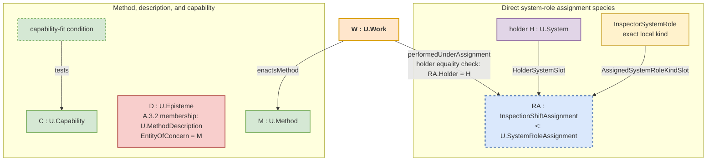

## A.15 - System-Role–Method–Work Alignment

> **Type:** Architectural (A)
> **Status:** Stable
> **Normativity:** Normative unless marked informative

**At a glance.** Use this pattern when a team must say which System performed which Work, under which assignment, which Method the Work enacted, and which plan applied without confusing any of those values with a description, capability, record, or result. A precise actual-performer branch first reuses A.13's core, then A.15.1 independently admits the dated Work, and only afterward F.6 uses the same obtaining assignment when precise assignment-bound attribution is current; an agency characteristic profile remains conditional on its receiving use.

**Use this when.** Separate a local system-role kind, an assignment occurrence that obtains, its holder system, a `U.Method`, any `U.MethodDescription`, a `U.WorkPlan`, a holder `U.Capability` instance, the capability-fit and evidence claims actually relied on, and dated Work before a schedule, display, document, or familiar label is treated as if it established the whole chain.

**Start here when.** The team is mixing system classification or assignment with recipe, schedule, capability, or performed Work, often under an ambiguous source word such as *role*, *process*, *workflow*, or *activity*.

**First output.** If the team is planning, name the intended `U.WorkPlan`, intended performer System, local system-role kind, and Method needed by the next decision; do not invent Work or an obtaining assignment. If performance has occurred, first recover the A.13 core and independently admit the dated Work under A.15.1 from its actual history, Method, extent, and containing-System relation. Then, only when precise assignment-bound attribution is current, establish F.6 `performedUnderAssignment` through the same obtaining assignment. Name only the assignment occurrence, declared species, holder System, and Method needed by this decision. Say plainly that the A.13-qualified holder System performed the Work under that same assignment and that the Work enacted the Method only when both relations obtain. Keep the local system-role kind, MethodDescription, WorkPlan, capability, assertions, records, and results separate in either branch.

**Working enactment-alignment sequence.** For precise actual performance, recover the A.13 core for the holder System and local agential kind -> recover the same obtaining assignment occurrence and its declared species -> separate Method from MethodDescription, WorkPlan from Work, and capability from performance -> independently admit the dated Work through A.15.1 -> apply F.6 only when precise assignment-bound attribution is current -> state only the relations needed by the next use -> proceed, plan, probe, narrow, use the pattern for another claim, or stop.

**Working alignment applications.**

1. For a precise actual-performer claim, recover the exact holder System, the local agential system-role kind and criterion, classification, same obtaining assignment, scope, working situation, window, and adequate A.13 core evidence. Add a characteristic profile only when a Grade, autonomy or profile result, criterion-dependent characteristic, or assurance use consumes it.
2. Name the declared assignment species and the occurrence that actually obtains. The species defines the holder and assigned-kind positions; the occurrence supplies their actual values. Add another participant only when it changes the assignment.
3. Name the Method and keep any MethodDescription separate. Name the intended `U.WorkPlan`, the actual dated Work occurrence, or both as the claim requires; never use one as proof of the other.
4. State `performedUnderAssignment` and `enactsMethod` only when their predicates obtain. The holder system performs the Work; neither the kind, assignment, Method, description, plan, nor capability acts.
5. If a visible item is being relied on for a Work, approval, evidence, gate, or release claim before the relation required by that claim is known, use `A.15.4`; keep only the alignment part here.

**Minimum sufficient use.** Recover only the values and relations needed by the receiving use. Ordinary orientation can stop at one clear sentence. A reliance-bearing claim may also need exact occurrence identity and extent, the selected source and its currentness, a capability-fit claim, and the evidence or assurance claim actually relied on.

**Recovered-reference sufficiency condition.** Proceed when every project-side value on which the claim relies is identified by its admitted kind, exact referent, scope, and current window. Otherwise narrow the claim, run a bounded reversible probe, recover the missing relation, or create only the smallest repair request, decision request, prospective WorkPlan entry, or missing-source note needed for the next use.

**Ordinary use.** “Robot-7 performed InspectionWork-17 under InspectionAssignment-17, and the Work enacted TurbineInspectionMethod” can be enough when the A.13 core, same obtaining assignment, F.6 link, and `enactsMethod` relation remain recoverable and the receiving use needs no additional identifiers. A Grade or autonomy profile is not implied.

**Reliance-bearing use.** Use the fuller frame when assignment identity, assignment state, Method edition, capability fit, plan baseline, approval, evidence, release, or disputed responsibility changes the decision. Responsibility and authority remain separate direct relations; neither follows from a system-role kind or assignment.

**Stop condition.** Stop once the separation changes no next admissible use and blocks no concrete overclaim about classification, assignment, assignment state, Method, plan, Work, result, approval, evidence, or release.

**Admissible-use examples.**

| Admissible project use | Source-finding or reversible probe | Non-admissible use |
| --- | --- | --- |
| A maintenance team identifies `PumpInspectorSystemRole`, the direct `MaintenanceInspectionAssignment` species and current occurrence, the inspection Method and its MethodDescription, and the current `U.WorkPlan`. After inspection, it identifies the dated Work occurrence and a separate inspection record. | A briefing says inspection is ready, but the MethodDescription, plan, or assignment occurrence is missing; use the briefing only to locate or repair that source before reliance. | A dashboard tile, copied approval, generated explanation, role label, or briefing is treated as the assignment, Method, WorkPlan, performed Work, or execution evidence. |

**Alignment frame in plain terms.** The system-role kind says what contribution kind is in question. The assignment relates this system to that kind in one actual episode. The Method is the way the Work is done. The WorkPlan says what is intended. The dated Work occurrence is what happened. Descriptions and records state claims about those values; they are not those values.

**What goes wrong if missed.** A team collapses classification, assignment, recipe, plan, capability, and performed Work into one fuzzy “process” or “role” label, then mistakes documentation for execution, capability for performance, a schedule for an occurrence, or an assignment for responsibility.

**What this buys.** A compact trace that answers who performed the Work, under which assignment, which Method the Work enacted, and which separate plan and evidence applied, while leaving every stronger neighboring claim to its direct pattern.

**Not this pattern when.** Use `A.15.1` for one dated Work occurrence, `A.15.2` for planning or schedule baselines, `A.15.5` for work-entry readiness, `A.16` or `A.16.1` for a cue that has not become an alignment question, `A.6` or `A.6.B` for boundary or policy wording, `E.10.ROLE` when *role* is still unresolved, and `A.15.4` when a visible item is being relied on by appearance.

**Related pattern contributions.** Use `A.2` and C.3 to identify exact local system-role kinds, `A.2.1` for direct `U.SystemRoleAssignment` species, A.13 for the precise local agency core and any conditionally consumed profile, `F.6` for performed-Work attribution through that same assignment, `A.15.1` for dated Work, `A.15.2` for WorkPlan epistemes, `A.15.3` for declaration-local planned-filling content inside a WorkPlan, `A.15.4` for work-relevant reliance by appearance, `A.15.5` for work-entry readiness, `F.11` to align Method and Work vocabulary across contexts, and `F.17` for the human-facing term sheet.

**Causal-use work boundary.** Counterfactual sampling, randomization, intervention assignment, target-trial emulation, and causal evidence collection can be represented here as Methods, MethodDescriptions, WorkPlans, dated Work occurrences, and their exact assignment and Method relations. A.15 does not make the resulting causal use admissible. Use `C.28` for the causal-use question, rung, estimand, separate evidence/identification/estimate/sampling/simulation components, counterfactual-sampling result, support result, and supported and unsupported uses.

**Related-record mistakes.** A cue, publication, plan, record, result, evidence item, or approval can help locate a value without becoming that value. Recover the dated Work under `A.15.1`. State a subject-specific production or result relation only under its direct pattern; for a production-work, entity-inception, or production-completion question, A.15.PROD may instead return one local claim or exact blocker. Use `A.15.4` only when reliance on an encountered appearance is the problem.

**Boundary to coarsened renderings.** A briefing, summary, redacted note, or coarsened rendering may orient work. Rely on it for an execution, approval, gate, or evidence question only when the exact sources and relations required by that use remain explicit and reopenable. Use `A.6.3.CSC` when coarsening itself changes what may be relied on.

**Outside-practice result boundary.** When one receiving decision or piece of Work needs a bounded result governed by another practice, use `A.15.9` to inspect an already-available result before requesting anything new, ask only for the remaining gap, and preserve supplier Method and authority separately from the receiving decision. A.15 keeps the underlying Method, Work, performer, assignment, communication, result, and record distinctions unchanged.

### A.15:1 - Problem frame

When the alignment is already clear and ongoing Work still needs one next action chosen from current facts within an applicable domain Method, use `A.15.7`. It keeps the domain Method, steering Method, deciding System, intended performer, and any later WorkPlan or performed-action claim separate.

Complex work requires several independent distinctions: what a System is; which local system-role kind classifies it; which assignment occurrence obtains and which declared `U.SystemRoleAssignment` species it instantiates; how Work is done through `U.Method`; whether an episteme is a `U.MethodDescription`; which holder capability is relied on; what `U.WorkPlan` states; which dated Work happened; and which separate assertions, records, results, and evidence concern that Work.

A.15 brings these already defined values together without creating a new process object or redefining their ontologies:

* **A.2 and C.3** identify a local system-role kind and any classification judgment. Classification neither creates an assignment nor proves Work.
* **A.2.1** identifies an assignment occurrence and its declared species under `U.SystemRoleAssignment`. The species declares `HolderSystemSlot`, a declaration-local `AssignedSystemRoleKindSlot` with its local system-role-kind domain, its predicate and applicability, any additional participants, and its occurrence-identity rule. The occurrence supplies the actual participants and extent. Taxonomy, scheme, signature, assertion, evidence, and interval may interpret or describe the claim; they are not generic participants.
* **A.13, A.15.1, and F.6** govern ordered but distinct results. A.13 supplies the exact System, local agential kind and criterion, classification, obtaining assignment, scope, working situation, window, and adequate core evidence; its characteristic profile is conditional. A.15.1 then independently admits dated Work. Only after admission, and only when the receiving use expressly consumes precise assignment-bound attribution, does F.6 relate that Work to the same assignment through `performedUnderAssignment`. Its holder projection is used only to compare holder equality with the actual performer already recovered through A.13; F.6 identifies neither assignment nor performer. Missing F.6 attribution does not revoke Work membership.
* **A.3.1 and A.3.2** keep `U.Method` distinct from `U.MethodDescription`.
* **A.15.1 and A.15.2** keep actual dated Work distinct from intended WorkPlan and from every record about either.
* **A.2.2, A.10, and neighboring direct patterns** keep capability-fit claims, evidence use, source currentness, publication, responsibility, authority, access, results, and assurance outside assignment and Work identity.

Use `E.10`, `E.10.ARCH`, and `E.10.ROLE` when source wording such as *process*, *workflow*, *action*, *activity*, *schedule*, or *role* has not yet been resolved. The wording chooses no FPF object by itself. Recover the exact Method, MethodDescription, WorkPlan, Work, Transformation, Dynamics, evidence, gate, source, publication use, participation relation, declaration slot, or ordinary non-technical use that the claim actually needs.

### A.15:2 - Problem

Without this alignment, several category errors recur:

1. **System-role-kind as part.** `AuditorSystemRole` is placed in structural `partOf` decomposition although it is a local kind used to classify systems.
2. **Description as execution.** A recipe, algorithm, SOP, or MethodDescription is treated as proof that Work occurred.
3. **Capability as Work.** Ability and actual performance are collapsed.
4. **Incomplete Work basis or attribution.** A Work claim lacks its required performer, assignment, or Method basis, or a precise assignment-bound attribution claim lacks its holder-equality check.
5. **Assignment as responsibility or authority.** Holding a system-role assignment is treated as if it established a duty, permission, responsibility, authority, or approval relation.
6. **Universal assignment record.** A permissive root signature hides different direct species and turns taxonomy, scheme, context, or source into generic participants.
7. **Actor by association.** A kind, assignment, capability, Method, description, plan, or record is made to act. Only the admitted holder system performs Work.
8. **Process soup.** One overloaded source word stands for classification, assignment, Method, description, plan, Work, result, and record at once.

### A.15:3 - Forces

| Force | Tension |
| --- | --- |
| Structure and enactment | Stable structural decomposition must remain distinct from system classification, assignment, Method, plan, capability, and dated Work. |
| Simple and specialized assignments | A simple assignment should remain light, while a real commission, position, or locus must retain the participant that distinguishes its species and occurrence. |
| Method, plan, and occurrence | A reusable Method, its description, intended Work, and performed Work must stay connected without becoming one record. |
| Clarity and precision | Practitioners need ordinary readable claims, while reliance-bearing use may need exact occurrence identity, evidence use, source currentness, or assurance. |
| Accountability and proportionality | Auditability may require a full trace, but ordinary orientation should stop at the shortest sufficient relation chain. |

### A.15:4 - Solution

Recover the actual values first, then state only the relations needed by the receiving use. A.15 aligns system-role kind, assignment, Method, MethodDescription, capability, WorkPlan, Work, and separate records; it does not create a universal process object or a universal assignment signature.

When source wording points to changing, producing, selecting, deriving, controlling, or maintaining an `EntityOfConcern`, use `E.10.ARCH` to recover the object. A workflow graph, process calculus, matrix, category, embedding, or neural representation may describe or serve as a lens over a Method relation structure; it is not automatically a Method, assignment, WorkPlan, or Work occurrence.

#### A.15:4.1 - Core entities kept distinct

* **Exact local system-role kind.** A value such as `InspectorSystemRole : U.Kind` is admitted under A.2 with C.3 through its `U.System` candidate domain, operative work-facing membership condition, member/non-member boundary, and continuity rule. It is not a system, assignment, relation slot, capability, Method, Work, responsibility, or authority. A system classification judgment and an assignment occurrence are separate claims.
* **`U.SystemRoleAssignment`.** This is the relation family consumed by A.15 and F.6. It has no permissive root `RelationSignature`. Each direct species declares `HolderSystemSlot : U.System`, a declaration-local `AssignedSystemRoleKindSlot` whose ValueKind is one exact local system-role-kind domain, its predicate and applicability, every real additional participant, and its occurrence-identity rule.
* **`U.Method`.** The run-independent semantic way of doing. A Work occurrence can stand in `enactsMethod(W, M)`; the Method does not act.
* **`U.MethodDescription`.** An already identified `U.Episteme` whose exact `EntityOfConcern` is an admitted Method and whose substantive claims say how that Method is done, as judged by A.3.2. Wording, file form, or publication alone establishes no membership.
* **`U.Capability`.** The A.2.2 holder-dependent ability instance. Capability statements, evidence, currentness assessments, and fit conditions are separate. Capability proves neither assignment nor performance.
* **`U.WorkPlan`.** A `U.Episteme` about possible future Work, including intended windows, dependencies, performers, and budgets. It does not bring a future Work occurrence into existence.
* **`U.Work`.** The admitted kind for concrete dated Work occurrences. One Work individual has its own temporal extent, at least one obtaining A.15.1 `enactsMethod` relation, and at least one obtaining locally declared containing-system relation. It may stand in further enactment, affected-referent, binding, resource-use, production, and result relations when the receiving use needs those independently obtaining facts. Any log, ticket, assertion, description, or performed-work record is a separate episteme.

**Work occurrence and record boundary.** Do not add a universal `primaryTarget` field, a local `kind` field, or an Operational, Communicative, and Epistemic enumeration to Work identity. Recover the exact affected-referent, transformation, speech-act effect, commitment effect, production, delivery, acceptance, or other relation under its direct pattern. Those adjectives can remain recognition cues; they do not define Work subkinds by enumeration.

**Didactic note for managers: the chef analogy.** `ChefSystemRole` is one local system-role kind. A kitchen-assignment species defines the holder and assigned-kind positions and adds shift, station, or commission only when it changes the assignment. A particular assignment fills those positions with the chef System, the kind, and any additional value. A cookbook can be a MethodDescription; the chef's skill can be a capability; a WorkPlan can schedule cooking; and making one souffle on Tuesday is dated Work. Its temporal and resource-use relations can state the 25-minute extent, eggs, butter, and consumed gas, while a kitchen log remains a separate episteme. A restaurant vocabulary or scheme can help interpret the claims without becoming a participant in every assignment. The cookbook, skill, plan, assignment, and log do not cook.

#### A.15:4.2 - Canonical relations

The diagram shows a simple direct assignment species. A stronger appointment can declare a real additional participant such as a review commission; that specialized occurrence itself is the `U.SystemRoleAssignment`. Do not create a weaker generic occurrence beside it.

* **Capability fit.** A MethodDescription, WorkPlan, or work-admission assertion may require a holder capability threshold. The fit condition tests the holder's `U.Capability` instance and may cite declared measures, `U.Characteristic` values, Q-Bundle slots, or architecture-characteristic criteria. It is neither an assignment participant nor a second capability kind.
* **MethodDescription membership.** `D` is a `U.MethodDescription` only when A.3.2 recovers Method `M` as its exact EntityOfConcern and at least one substantive way-of-doing claim. “D describes M” is shorthand for that constitution and membership result, not another binary relation.
* **`enactsMethod(W : U.Work, M : U.Method)`.** This relation states which exact Method the dated Work enacts. A.15.1 defines its participant order, predicate, occurrence identity, and multiplicity. It neither attributes a performer nor turns a description into the Method.
* **`performedUnderAssignment(W : U.Work, RA : U.SystemRoleAssignment)`.** F.6 defines this relation. For a precise actual performer, `RA` is the same obtaining assignment used by A.13 for the exact action, scope, working situation, and window. It must be an occurrence of a declared assignment species, have the A.13-qualified System as holder, and cover the Work while the species predicate obtains. The assignment is the attribution ground, not the actor. A record may state the relation without constituting it. Read an existing `performedBy(W, RA)` claim only through the F.6 compatibility boundary after resolving the holder System; do not author new claims with that spelling.

One assignment occurrence continues through the maximal uninterrupted interval in which its direct species predicate obtains for fixed participants. A declared interval, taxonomy, scheme, KindSignature, assertion, evidence item, or selected model-use structure can describe or interpret the claim but does not create the occurrence or become a generic participant.

For a precise performed occurrence, first recover the A.13 core for the exact actual performer System and action, then admit `W : U.Work` under A.15.1 from its independent occurrence, Method, extent, and containment facts. Only afterward trace `W` to the same `RA` through F.6 `performedUnderAssignment` when the receiving use needs precise assignment-bound attribution, and compare `RA.HolderSystemSlot` with the already recovered performer; F.6 identifies neither. Trace `W` to `M` separately through `enactsMethod`. Cite a characteristic profile only when conditionally consumed; cite a MethodDescription, plan, capability claim, evidence item, taxonomy, or scheme separately only when the receiving use relies on it. The performer System acts; the kind, assignment, capability, Method, description, plan, evidence, and record do not.

#### A.15:4.3 - Bounded specialization scouting and `CheckpointReturn`

When one human-plus-AI pair faces a new task or solution family, identify each participating human or AI service as an admitted System before using this alignment. The pair may use four local system-role kinds for this bounded work: `OutcomeCriterionHolderSystemRole`, `AIScoutSystemRole`, `AISpecialistProbeSystemRole`, and `CommitAuthoritySystemRole`. Claim an assignment only by naming its occurrence and declared species under `U.SystemRoleAssignment`. The `CommitAuthoritySystemRole` name does not supply decision authority; any authority relation must obtain independently.

First distinguish the probe's question. If another probe could change which option survives the `OptionSet`, return to C.11. If changed live facts or domain-Method limits could change the next action during ongoing Work, return to A.15.7. Use the enactment checkpoint below only when the action or option is fixed, tool or service calls must be planned, and route shape or rollout order is uncertain.

The pair declares one outcome criterion, explores several candidate routes for that fixed action or option, spends a bounded scouting or probing budget before commitment, and returns one `CheckpointReturn` comparing the tested routes. Keep scouting budget, probing budget, and commit checkpoint distinct. Use A.15 only for this dyadic assignment, Method, plan, and Work alignment; use C.24 for checkpoint-record semantics and E.16 for budget and guard enforcement.

Every `CheckpointReturn` carries:

- the declared outcome criterion and current `TaskFamily`;
- the candidate approaches actually tested;
- evidence observed for each tested approach, including progress toward the work-measure threshold and important failure signals;
- burned and residual budget;
- the recommended next use: continue probing, commit to planned Work, narrow the Method or claim, use the direct pattern for another claim, or stop; and
- the commit trigger that would justify leaving the bounded probe.

The return is evidence about candidate approaches, observed results, budget, and the commit trigger. It is not the selected Method, `U.WorkPlan`, or actual Work. Execution-evidence, provenance, and rollout-decision claims need their own admitted values and relations before committed rollout.

Low-human-overlap approaches remain admissible here only while they stay tied to the outcome criterion, budget limits, and the exact evidence or provenance relation used by the receiving claim.

#### A.15:4.4 - Boundary to A.15.4 Work-Relevant Appearance-Based Reliance Repair

Use `A.15.4` when an encountered episteme, carrier, display, credential view, generated explanation, copied statement, provenance mark, dashboard tile, schema wording, API wording, or source-relation chain is being relied on by appearance for Work, assignment currentness, assignment state, source currentness, approval, authorization, gate passage, evidence, engineering justification, release, or another reliance-bearing claim.

A.15 itself keeps the exact local system-role kind, holder system, direct assignment occurrence, Method, MethodDescription, WorkPlan, dated Work occurrence, and every separate episteme distinct. A.15.4 recovers the project-side value and relation that must hold before the visible item can warrant the attempted use.

A principle scheme, functional diagram, scenario, screen, or explanation that exposes an `E.18.1` P2W carry-through structure may help a team plan Work or find a source. It does not become the selected Method, plan, Work occurrence, result, evidence, or authority by publication.

#### A.15:4.4a - Inspecting Method–Work Alignment Across an Unfolding Structure

Do not create a linkage record merely because one unfolding structure mentions several Method- and Work-related values. Keep each direct relation under the pattern that defines it. When a receiving use must preserve an inspectable explanation across those relations, write one bounded `C.2.1` episteme whose EntityOfConcern is the exact selected unfolding `U.Structure`. Its ClaimGraph may cite, as separate claims, the selected Method and Method-relation structure, MethodDescription epistemes, relevant local system-role kinds and assignment occurrences, the Work that enacts the Method, Work-part relations, independently identified transformations and their direct Work-to-change claims, intended WorkPlans, readiness results, capability-fit conditions, evidence, assurance, and gate decisions. Include only claims needed by that receiving use.

Call this episteme a *Method–Work alignment account* in ordinary prose. Its identity comes from its EntityOfConcern, ClaimGraph, and effective ReferenceScheme, not from a field bundle. Each claim in the account remains defined or tested by its own pattern: A.3.1 for Method, A.3.2 for MethodDescription, A.15.2 for planning, A.15.5 for readiness, A.15.1 for dated Work and Work relations, A.10 for evidence, B.3 for assurance, A.20 for internal-constraint results, and A.21 for gate decisions. If the useful account would need several unrelated entities of concern, split it instead of using one umbrella record.

Another structure, such as CGUS, P2W, P2S, an improvement-loop slice, or a transformation-flow slice, may cite the exact episteme only when its receiving use needs this alignment explanation. The citation creates none of the cited relations and cannot replace their sources, currentness checks, or criteria.

#### A.15:4.5 - Boundary to A.15.5 Work-Entry Readiness

Use `A.15.5` when the current question is whether intended Work is ready to enter its boundary. A.15 keeps system-role kind, assignment, Method, plan, and Work distinct; A.15.5 carries `WorkEntryReadiness@Context`, `FullKitCondition`, commitment disposition, resource-readiness references, WIP or flow-policy references, planned baselines, and launch-gate references when those values are current.

Readiness is not performed Work, evidence sufficiency, or gate passage. A briefing, dashboard, source bundle, or P2W record may cue A.15.5, but a readiness result needs the WorkPlan being judged, the PlanItem content used by the criterion, missing inputs, any performed preparation Work, the planned baseline, and the stop or degraded-use condition. Address the PlanItem content through that WorkPlan; it is not another readiness target.

### A.15:5 - Archetypal Grounding

Use this alignment whenever the live question joins a holder system, exact local system-role kind, assignment occurrence, Method, plan, capability, or performed Work. Physical engineering, knowledge work, and socio-technical work can use the same distinctions without turning A.15 into a universal process ontology.

**Boundary case — possessed algorithm versus enacted Method.** `Robot-7 : U.System` is classified under `InspectorSystemRole` and is the holder of `InspectionAssignment-17`, an occurrence of a direct maintenance-assignment species. A capability claim may say that Robot-7 can inspect turbines, and source prose may say it “possesses inspection algorithm A”. Neither claim is dated performance, and neither makes `TurbineInspectionProcedure-v3` a `U.MethodDescription`. If `InspectionWork-17` occurs, first recover Robot-7's full A.13 core through that same obtaining assignment and let A.15.1 independently admit the Work. Then, because this alignment also expressly consumes precise assignment-bound attribution, establish F.6 through `InspectionAssignment-17`. The already recovered performer performed the Work under that assignment, and the Work enacted `TurbineInspection@Maintenance-2026`. Use A.3.2 to decide whether the procedure episteme is a MethodDescription. Robot-7 acts; the kind, assignment, capability, algorithm wording, Method, and description do not.

| Alignment position | Manufacturing | Scientific peer review |
| --- | --- | --- |
| Exact local system-role kind | `WeldingRobotSystemRole` | `PeerReviewerSystemRole` |
| Holder system | `ABB_Robot_Model_IRB_6700`, designating one particular robot `U.System` in this hypothetical case; IRB 6700 is its model designation | `Dr_Alice_Smith`, modeled as an admitted `U.System` |
| Direct assignment species and occurrence | `FactoryWeldingAssignment` with the robot and `WeldingRobotSystemRole`; include another participant, for example a factory line or work order, only if that species predicate depends on it | `JournalReviewAssignment` with Alice and `PeerReviewerSystemRole`; a commission-sensitive appointment species also carries the exact review commission |
| Separate semantic sources when used | `FactoryProductionSystemRoles-2026` and `Factory-Line-B-Scheme` may be used as sources for classification or interpretation claims under the applicable source and evidence relations | `PhysicsPeerReviewSystemRoles-2026` and `PhysicsLetters-A-Review-Scheme` may be used as sources for classification or interpretation claims under the applicable source and evidence relations |
| Selected model-use structure, only when current | Cited by the receiving factory interpretation claim, never inserted as a participant of every assignment species | Cited by the receiving journal interpretation claim, never inserted as a participant of every assignment species |
| `U.MethodDescription` episteme | `Welding_Procedure_WP-28A.pdf`, with `WeldingMethod` as exact EntityOfConcern and substantive way-of-doing claims | `Peer_Review_Guidelines_v3.docx`, with `PeerReviewMethod` as exact EntityOfConcern and substantive way-of-doing claims |
| Holder capability, when relied on | ability to execute a 3F welding seam within a declared envelope and current window | ability to evaluate a quantum-optics manuscript within a declared envelope and current window |
| Work occurrence | `Weld_Job_#78345`, whose temporal relation covers 15:32–15:34 UTC; separate resource-use relations connect 1.2 kWh and 5 g Argon, and `enactsMethod` connects `WeldingMethod` | `Review_of_Manuscript_#PL-2025-018`, whose temporal relation ends on 2025-08-15; a separate resource-use relation connects four hours of reviewer time, and `enactsMethod` connects `PeerReviewMethod` |

**Key takeaway.** Both cases use an admitted holder System, a local system-role kind, an assignment occurrence and its declared species, a Method, a separate MethodDescription, a capability relied on for the case, and dated Work. Their taxonomies, schemes, commissions, records, and results remain separate values and relations. This common alignment does not erase their different domain ontologies.

#### A.15:5.1.a - Briefing guides orientation, not execution

**Source set.** A release team has one deployment method description, one current work plan, one approval or decision record when required, and the evidence records and evidence relations used to decide whether the rollout may proceed. A short rollout briefing is prepared for the daily stand-up.

**Briefing slice.** `Status briefing only: rollback procedure appears verified in the current source bundle. Execution remains tied to the deployment method, work plan, required approval or decision record, and evidence relation.`

This briefing may orient the team and cue attention. If the team wants to execute from the briefing alone, use `A.15.4` or the evidence, gate, decision, or assurance pattern that defines or tests the claim to recover the missing project-side kind and reference. Inside `A.15`, keep only the system-role kind, assignment, Method, plan, and Work-occurrence separation.

#### A.15:5.1.b - P2W principle-scheme publication guides planning, not occurrence

**Source set.** A team has a principle scheme that shows an `E.18.1` P2W carry-through structure for a fabrication task: signature or principle episteme, method-family selection, selected method, `U.WorkPlan`, an actual Work occurrence admitted under `U.Work`, a separate work-result record, and result measurement.

**Published slice.** `For this batch family, method M-2 is selected from the declared method family; prepare work plan WP-17 before any actual Work occurrence exists.`

This publication may guide method inspection and work-planning preparation under `A.15`. A conforming use keeps selected method, `U.WorkPlan`, actual dated Work occurrence, separate assertion or record about it, work-result record, and result measurement distinct. If the publication is used for evidence, provenance, engineering justification, gate or constraint decision, physical medium, screen, export, OCR behavior, or publication-use, use the pattern that defines or tests that claim. If no project-side kind and reference named by value exists, create only an `A.15.4` repair request, decision-request record for the next decision, prospective work-plan entry, or explicit missing-source-relation note.

#### A.15:5.1.c - Scenario guides method selection, not performed work

**Source set.** A method-selection scenario says that material X is below threshold T, resource window W is available, and the fabrication cell is under setup condition S. The scenario is admitted source material; a publication form or carrier may expose that source material for choosing between method families but does not become the selected method or plan.

**Published slice.** `Under scenario S, method family MF-2 is admissible for planning; choose the selected method and prepare the work plan before execution.`

The scenario can guide method-family selection and work-planning preparation. Once the team selects a method or prepares a plan, state that project choice or plan in a separate episteme. If an actual Work occurrence is later claimed, ground that world-side individual independently under `A.15.1`; a separate assertion or performed-work record may designate it but does not become the occurrence. If the scenario is used for evidence, gate, or engineering-justification reliance, first recover the project evidence relation, gate or constraint decision, or engineering-justification record named by value under `A.10`, `A.20`, `A.21`, or `B.3`; otherwise record only an `A.15.4` repair request, decision-request record, prospective work-plan entry, or missing-source-relation note.

### A.15:6 - Bias-Annotation

Bias lenses: **Gov**, **Arch**, **Onto and Epist**, **Prag**, **Did**. Scope: **Universal** for system-role–Method–Work alignment across engineering, operational, and knowledge-work settings.

| Bias risk | Failure | Repair |
| --- | --- | --- |
| Governance bias | A familiar system-role label, assignment row, approval display, or status is treated as proof that Work happened or responsibility obtains. | Keep classification, assignment, Work, responsibility, authority, and evidence in their direct relations. |
| Architectural bias | A system-role kind, capability, fit condition, Method, or record is placed in structural decomposition. | Keep structure, classification, dependent capability, relations, epistemes, and dated Work distinct. |
| Epistemic bias | A recipe, schedule, roster, or log is treated as its world-side referent. | Recover the exact Method, assignment, WorkPlan, Work, and obtaining relations; keep the source as an episteme. |
| Pragmatic bias | One overloaded *process* or *role* term is retained because it feels shorter. | Use `E.10.ARCH` or `E.10.ROLE`, then write the shortest sentence that names the recovered values. |
| Didactic bias | The chef analogy hides direct-species and occurrence requirements. | Pair it with one concrete assignment species and one F.6 attribution; do not require a full schema for ordinary use. |

### A.15:7 - Conformance Checklist

| ID | Check | Why |
| --- | --- | --- |
| **CC-A15-1** | Keep exact local system-role kind, `U.SystemRoleAssignment`, `U.Method`, `U.MethodDescription`, `U.Capability`, `U.WorkPlan`, `U.Work`, and every record or result distinct. | Prevents one alignment frame from becoming one object. |
| **CC-A15-1a** | Treat a dated Work individual as world-side; keep assertions, descriptions, logs, tickets, and performed-work records as separate epistemes. Actual performer, Method, temporal, locally declared containing-system, affected-referent, binding, and resource-use relations obtain independently and are not stored fields of the occurrence. | Blocks record fields from constituting Work. |
| **CC-A15-2** | Keep the reusable Method, its description, intended Work, and performed Work distinct. Operational events do not mutate a MethodDescription or WorkPlan. | Prevents recipe, schedule, and execution collapse. |
| **CC-A15-3** | For a precise actual performer, reuse the A.13 core and independently admit dated Work through A.15.1. Only when the receiving use expressly consumes precise assignment-bound attribution, relate that Work through the same obtaining occurrence of a directly declared species under `U.SystemRoleAssignment`; confirm that `RA.HolderSystemSlot` equals the already recovered performer and that the assignment predicate covers the Work interval. Require a characteristic profile only when conditionally consumed. | Preserves the independently recovered performer and Work while adding only the conditional attribution; F.6 discovers neither and no universal assignment signature is invented. |
| **CC-A15-4** | For precise assignment-bound attribution, trace the A.13-qualified `H` through the same obtaining assignment `RA`, then `W -performedUnderAssignment-> RA`, `RA.HolderSystemSlot -> H`, and `W -enactsMethod-> M`. Cite characteristic profile, MethodDescription, plan, capability, source, and evidence separately only when relied on. | Preserves one inspectable A.13→A.15.1→F.6 chain without turning interpretation metadata into participants. |
| **CC-A15-5** | Keep system-role kinds, capabilities, fit predicates, Methods, and evidence or assurance records out of `partOf` hierarchies unless another direct pattern admits a structural relation. | Blocks classification, evidence, and assurance as parts. |
| **CC-A15-6** | Attribute resource use to dated Work through exact obtaining relations, not to a MethodDescription, WorkPlan, capability, assignment, or fit predicate. | Keeps costs with performance. |
| **CC-A15-7** | Use `U.WorkPlan` for intended Work and identify actual Work independently. | Stops schedule-as-performance drift. |
| **CC-A15-8** | Resolve unqualified *process*, *workflow*, *activity*, *schedule*, and *role* wording through `E.10.ARCH` or `E.10.ROLE`. | Prevents wording cues from choosing ontology. |
| **CC-A15-9** | State `enactsMethod` and `performedUnderAssignment` separately. Only the admitted holder System with its A.13 core performs Work; a profile is conditional. A capability or algorithm-possession phrase proves neither performance nor MethodDescription membership. Spontaneous physical evolution without this alignment is not Work. Use A.3.4 to identify an actual bounded change, and A.3.3 when a `U.Dynamics` episteme describing its state space and transition law is needed. | Prevents kind, assignment, capability, Method, description, plan, dynamics, and records from becoming actors. |
| **CC-A15-10** | Treat a speech act that institutes an assignment, authorization, or gate-relevant effect as its own Work occurrence only when A.15.1 admission and the exact effect relation obtain. | Keeps the communicative Work distinct from later operational Work. |
| **CC-A15-11** | Recover the assignment's direct species, exact local assigned-kind domain, real participants, predicate, and occurrence. Taxonomy, scheme, signature, context, and source are cited separately when the receiving claim uses them. An approver or deployer label neither creates a Work subkind nor proves performance. | Prevents a permissive assignment record and kind-by-label. |
| **CC-A15-12** | Represent causal intervention and sampling work only through exact Methods, MethodDescriptions, WorkPlans, Work occurrences, assignment attribution, and Method enactment. Use `C.28` for the causal-use question, rung, estimand, separate support components, causal-use support result, supported use, and unsupported use. | Keeps work alignment from becoming causal authority. |
| **CC-A15-13** | Use A.15.4 when a visible item is relied on by appearance; retain only the system-role–Method–Work separation here. | Keeps reliance repair out of the alignment kernel. |
| **CC-A15-14** | Keep an E.18.1 P2W structure, its publication, selected Method, WorkPlan, Work, result record, and measurement distinct. | Publication alone establishes none of the project-side values. |

### A.15:8 - Common Anti-Patterns and How to Avoid Them

- **System-role-kind as part.** Do not place `InspectorSystemRole`, a capability, fit condition, or evidence or assurance record in structural decomposition merely because it appears on an architecture diagram.
- **Universal assignment signature.** Do not give `U.SystemRoleAssignment` one permissive root signature. Recover the direct species and its exact local assigned-kind domain.
- **Generic assignment beside an appointment.** Let the specialized appointment occurrence itself belong to `U.SystemRoleAssignment`; F.6 uses its common holder projection.
- **Recipe as evidence.** A MethodDescription can identify or constrain a Method but does not prove performed Work.
- **Plan as performed Work.** A schedule or intended-assignment claim remains distinct from dated Work, which is identified independently under A.15.1; use A.15.2 for WorkPlan membership.
- **Capability as Work.** Ability, a capability statement, or a passing fit condition is not performance.
- **Assignment as responsibility or authority.** Recover the direct neighboring relation required by the claim, for example responsibility, commitment, permission, authority, access, or gate passage, or return its exact missing governor.
- **Approval collapse.** Keep approval or authorization Work and the operational Work it permits as separate occurrences and effect relations.
- **Process soup.** Resolve ambiguous source wording before relying on it; do not create a generic process object.
- **Appearance as execution.** Use A.15.4 when a dashboard, credential, copied approval, generated explanation, provenance label, or command-like cue is being relied on by appearance.
- **P2W publication as Work.** A principle scheme, functional diagram, scenario, screen, or explanation can guide planning without becoming Method, WorkPlan, Work, result, evidence, gate, or justification.

### A.15:9 - Consequences

| Gain | Cost or trade-off |
| --- | --- |
| Teams can ask which System performed which Work, under which assignment and Method, without making a kind or document act. | Reliance-bearing use must recover the assignment occurrence and its declared species rather than stop at a familiar label. |
| Simple assignments stay simple while commission-, position-, or locus-sensitive assignments preserve their real participants. | Each bounded vocabulary must admit the direct species and local system-role-kind domain it actually uses. |
| MethodDescription, WorkPlan, Work, result, and evidence can change independently. A MethodDescription can be revised without rewriting past Work; a holder can be replaced when the replacement satisfies the required classification, assignment, and capability-fit conditions. | A decision-relevant case may need several short direct claims instead of one overloaded record. |
| Responsibility, authority, permission, capability, assignment state, and result stay available without being inferred from assignment. | The receiving use must say which of those stronger relations it truly needs. |
| The chef analogy and ordinary first sentence make the distinction teachable. | Readers still need one concrete direct-species example so the analogy does not hide assignment identity. |

For example, `AuditorSystemRole` can be the local kind used by an audit-assignment species. A particular assignment names its holder System, but this precise attribution still requires F.6 to relate `ApprovalWork-17` to that same assignment and confirm holder equality with the A.13-qualified performer after A.15.1 independently admits the Work. Any decision authority, responsibility, gate effect, Method, capability fit, result, and evidence are separate claims. The kind name and assignment prove none of them.

### A.15:10 - Rationale

The practical failure is simple: teams often store classification, assignment, recipe, plan, capability, execution, result, and evidence in one “process” record, then cannot tell which fact changed. A.15 keeps the values separate and adds only the two alignment relations needed most often: performed-Work attribution and Method enactment.

The separation follows established ontology and practice distinctions among enduring systems, relation occurrences, event-like Work, and epistemes. Process-theory formalisms such as Petri nets and process calculi remain source lineage for dynamic interaction, but their word *process* is recovered here to Method, MethodDescription, WorkPlan, dated Work, Dynamics, Transformation, or a separate episteme rather than imported as one FPF object. FPF adapts the useful distinctions through local system-role kinds, assignment species and their occurrences, a common holder projection, Methods, WorkPlans, dated Work, and neighboring relations; it does not import a foreign hierarchy.

The distinction is operationally useful. When work fails, a team can ask whether the wrong system was assigned, the assignment did not cover the Work, the Method was unsuitable, the MethodDescription was wrong, the plan was stale, the capability claim was unsupported, or the performed occurrence departed from the Method. Correcting one answer need not rewrite the others.

### A.15:11 - SoTA-Echoing: Adopted Invariants and Rejected Shortcuts

| Practice need | Source line and status | FPF adaptation | Rejected shortcut |
| --- | --- | --- | --- |
| Keep case, decision, plan, and executed occurrence separable. | OMG CMMN 1.1 (2016) and OMG DMN 1.5 (2024) provide mature modeling lineage; ITIL 4 Change Enablement (2023) provides current practitioner guidance. | Keep MethodDescription, WorkPlan, approval Work, and operational Work separate, with every Work occurrence admitted on its own A.15.1 basis. | One undifferentiated *process* object. |
| Keep system classification, relation occurrence, and dated Work distinct. | Almeida, Guizzardi, Sales, and Fonseca, gUFO (2026 preprint), is a current foundational-ontology comparator rather than imported hierarchy. | Retain FPF's exact local system-role kinds, direct assignment species, holder projection, and Work identity laws. | A foreign role hierarchy or relation model deciding FPF identity. |
| Recover event, performer, qualified association, and records without making a log row the event. | OCEL 2.0 (2024) is current object-centric event-log practice; W3C PROV-O (2013) is representation lineage. | Identify dated Work and the exact assignment occurrence first; keep logs and provenance as separate epistemes and relations. | Anonymous Work, assignment by label, or record-as-occurrence. |
| Keep authorization acts and the operations they permit distinct. | ITIL 4 Change Enablement (2023) and DMN 1.5 (2024) separate assessment, decision, authorization, scheduling, and realization. | Admit each communicative or operational Work occurrence independently and state its exact effect relation. | Approval collapsed into later operational Work, or label-defined Work subkinds. |
| Keep bounded exploration separate from committed rollout. | Current agentic tool-use, self-correction, and human-in-the-loop work-control practice extends the ReAct, Toolformer, and Reflexion lines with explicit checkpoints and bounded tool use. | When an action or option is fixed, tool or service calls must be planned, and route shape or rollout order is uncertain, use exact local system-role kinds and assignments for the participating systems, and return candidate evidence, budget, and a commit trigger in `CheckpointReturn`. | One successful probe silently becomes the selected Method, WorkPlan, or rollout. |

Use FPF's direct identity rules for alignment, not SysML v2 or ISO 42010. Use `C.30.AD` for architecture-description questions.

For visible credential, provenance, dashboard, explanation, or composed-source cases that require a project-side value and relation before reliance, use A.15.4.

### A.15:12 - Relations

* `A.15.9` coordinates one receiving decision or piece of Work with one bounded result governed by another practice. It first tests an already-available result, requests only a remaining gap, and preserves supplier Method and authority separately from receiver decision authority; it creates no new alignment object or result kind.

* `A.15.7` supplies the situation-responsive steering Method after current Work, its domain Method, and relevant facts are known; it returns the selected action, intended performer, and stop or feedback condition without making the answer into Work.

* **Architecture-work boundary:** C.32.P2S and C.32.PAD may cite MethodDescriptions, pattern-use references, exact system-role assignments, separate responsibility or authority relations, readiness exits, and expected structure effects. C.32.ADR may publish those references. A.15 supplies only Method, description, plan, readiness, performed Work, and attribution distinctions.
* **Uses:** `A.7` for strict distinction among system-role kind, assignment, Method, MethodDescription, plan, Work, and records.
* **Builds on:** `A.2` and C.3 for exact local system-role kinds and classification; `A.2.1` for direct `U.SystemRoleAssignment` species; A.13 for the precise local agency core and conditionally consumed profile; `A.2.2` for capability; `A.2.5` for `SystemRoleAssignmentStateRelation`; `A.2.7` for relations among system-role kinds; `A.6.5` for relation-slot discipline; A.3.1/A.3.2/A.3.3/A.3.4 for Method, MethodDescription, Dynamics, and Transformation, respectively; `A.15.1` for independent Work admission; `A.15.2` for WorkPlan; `A.15.3` for declaration-local planned-filling content inside that WorkPlan; `A.15.5` for readiness; and F.6 for the later `performedUnderAssignment` relation and holder-equality projection only when precise assignment-bound attribution is consumed.
* **Coordinates with:** A.15.4 for work-relevant reliance repair; E.10, E.10.ARCH, and E.10.ROLE for wording recovery; A.6 for boundary and policy claims; A.10 for evidence and provenance; B.3 for assurance; A.20 and A.21 for constraints and gates; C.28 for causal-use admissibility; C.29 for mathematical-lens use; E.18.1 for P2W carry-through; C.32.P2S for architecturing-flow references; and E.17.EFP for generated-explanation faithfulness.
* **Used in:** claims that must keep systems, local system-role kinds, assignments, Methods, WorkPlans, Work occurrences, result records, and reliance repairs distinct. A.15 is not a generic process ontology, workflow engine, evidence graph, gate pattern, or publication pattern.

### A.15:12a - Coordinated-work evidence and distributed-state relation note

Use A.15 first when the claim concerns which system performed which Work, under which system-role assignment, which Method the Work enacted, and which separate result is claimed. Coordinated Work, routine skill, team alignment, tacit knowledge, and fit among assignment, Method, and Work are not quantum-like by default.

Application choices:

1. Name the holder systems, local system-role kinds, exact assignments, Methods, Work occurrences, and separate results needed by the claim.
2. State which Work occurrences and which separate C.2.1 assertions, traces, observations, reports, or metrics make the coordination visible.
3. Ask whether ordinary system-role–Method–Work alignment explains the case. If yes, stop in A.15.
4. Add a C.26.2 low-recoverability distributed-state reading only after establishing its collective `U.System` bearer and boundary under C.26.2, and only when no participant statement, local component report, single evidence record, dashboard, or exported representation carries the inferred state faithfully enough for its intended use. Without that collective bearer, retain ordinary A.15 alignment of individual performers.
5. State the weakest evidence-bound reading, its time window, rival explanations, and export loss.
6. Use A.10 for evidence provenance and bounded reliance, and C.26.2:4.11 to select the evidence posture and additional support for the intended use. Obtain a B.3 assurance result for the named target claim and receiving use when an actual assurance claim is current. QLP-3 use or a direct domain requirement for assurance requires that claim and result. Momentary, low-consequence local Work guidance does not by itself require B.3.

The C.26.2 reading is a minimal evidence-bound `U.Episteme` claim about that collective System. It is not a group mind, performed Work, evidence sufficiency, or assurance by itself.

| Position | Required content |
| --- | --- |
| Evidence or provenance relation | Exact Work, or a separate assertion, trace, observation, report, or metric about it, connected to the reading through an independently established direct evidence/provenance relation, recoverable through A.10 or G.6 |
| Time window | When the reading holds and when it decays or needs refresh |
| Probe or occasion | The question, task, workshop, incident, handover, dashboard, or coordination situation that made the state inferable |
| Weakest claim | The minimal distributed-state reading carried by the sources |
| Rival explanations | For example, routine compliance, policy, command, coincidence, incentive, documentation, or local skill |
| Export loss | What is lost when the reading is summarized into one report, score, or statement |

Useful outputs are an A.15 alignment claim when assignments and Work explain the case; a C.26.2 reading about the declared collective System within its boundary when the evidence survives ordinary rivals; an A.10 account of the evidence relation; a B.3 assurance result for a current named assurance claim, including the claim required by QLP-3 use or a direct domain rule; or no distributed-state reading when the sources, rivals, or time window cannot be named.

### A.15:12b - C.29 mathematical-lens use relation

When a mathematical lens helps select a Method, compare Method families, shape a WorkPlan, or diagnose Work, use C.29 only for the mathematical-lens use supporting that diagnostic or selection reason. The next concrete value remains under its direct pattern: `ChoiceResult` or another local choice record when a choice is made, the selected Method when Method selection is claimed, `U.WorkPlan` for intent, dated Work for execution, a separate result record for a result claim, and A.15.4 when a reliance appearance is being used as the reason before the required relation is known. A mathematical lens may explain why a distinction is useful; it does not make a plan into performed Work or a Method explanation into execution evidence.

### A.15:12c - P2W Work-Family Split

When an E.18.1 P2W use reaches work planning or work-entry readiness, keep the selected Method, one `U.WorkPlan` with any declaration-local `SlotFillingsPlanItem` content, `WorkEntryReadiness@Context`, dated Work occurrence, and separate result records distinct. A planned-filling row is addressable only through that WorkPlan and gains no independent identity. A principle scheme, functional diagram, or scenario may guide Method inspection and planning only after the current work-family value is named.

Work planning may cite evidence and currentness requests for the direct relation under repair. A.15.5 may cite the exact WorkPlan and designate declaration-local PlanItem content when its readiness criterion uses that content. Name evidence, gate passage, performed Work, result measurement, assurance, or refresh before relying on a planning or readiness record for that stronger claim.

### A.15:12d - P2W Performed-Work Relation

When E.18.1 reaches performed Work, keep `U.Work` as the admitted kind and identify one exact dated occurrence under it. `WorkEnactment` is not a second kind or pseudo-object between plan and occurrence.

A performed-work record is a separate `U.Episteme`. It may cite a WorkPlan, planned baseline, and exact Work occurrence. It can state bindings, performed values, substitutions, variance, telemetry, outputs, outcome claims, and result references only through independently obtaining relations; none is stored in or constituted by the Work occurrence. Comparator, transport, `PrincipleFrame`, formal-substrate signature, evidence, assurance, and gate relations remain separate.

### A.15:12e - P2W Integration as System-Role Assignment and Work Feasibility

When E.18.1 uses *integration* to ask whether an admitted system can hold an exact local system-role kind and perform Work under interface constraints, name the system-role kind, the direct `U.SystemRoleAssignment` species and occurrence when assignment is claimed, the Method or MethodDescription, the relevant WorkPlan or Work occurrence, and the interface constraints defined by the architecture or module-interface pattern.

Classification, assignment, capability fit, interface satisfaction, authority, responsibility, Method selection, planning, and performed Work remain separate claims. Other connected values, for example artifacts, telemetry, acceptance records, diagrams, selected structures, checks, gates, evidence, and provenance, also keep their direct relations.

### A.15:12f - Lowering, Repair, and Refresh Conditions

Lower an A.15 claim when the holder system, exact local system-role kind, direct assignment species or occurrence, Method, MethodDescription, WorkPlan, readiness relation, dated Work, or capability fit cannot be named at the granularity needed by the next use. A weaker result can be a separation note, missing-source note, A.15.4 repair request, decision request, prospective WorkPlan entry, or A.15.5 readiness-gap note.

Repair only the relation that changed. A corrected assignment or `SystemRoleAssignmentStateRelation` does not rewrite the Method; a changed WorkPlan does not rewrite performed Work; corrected evidence or source-currentness does not rewrite assignment or Work; and an A.15.4 repair request carries no stronger A.15 claim.

Refresh before reliance when the exact local system-role kind or its criterion changes, the assignment species or predicate changes, another assignment occurrence is needed, the Method family or WorkPlan changes, the execution window changes, or a result, evidence, assurance, gate, reliance, or mathematical-lens relation is no longer current. A taxonomy, scheme, KindSignature, or selected model-use structure triggers refresh only when the receiving claim actually depends on the changed semantic basis. If the remaining question is no longer system-role–Method–Work alignment, use its direct pattern and keep only the A.15 separation still needed.

### A.15:End
